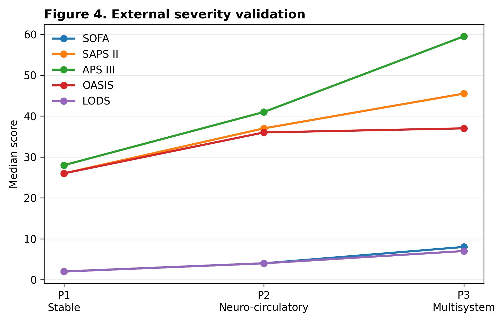
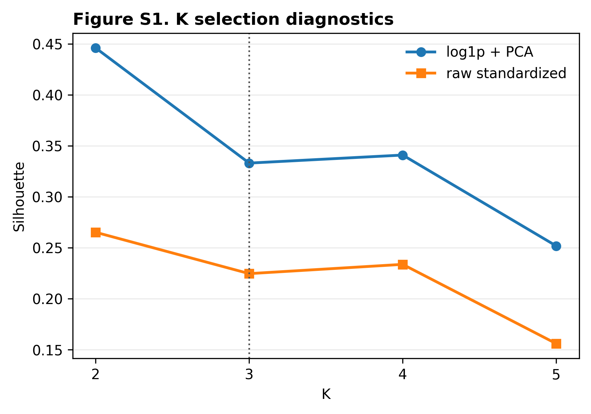
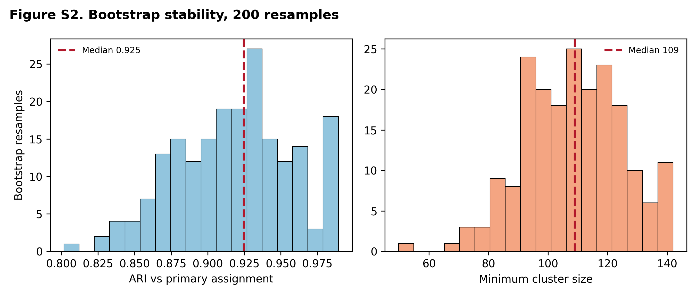
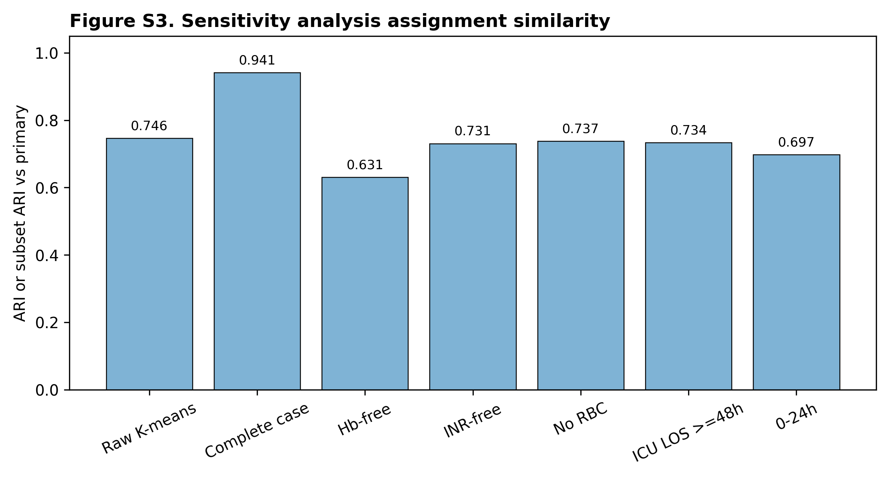
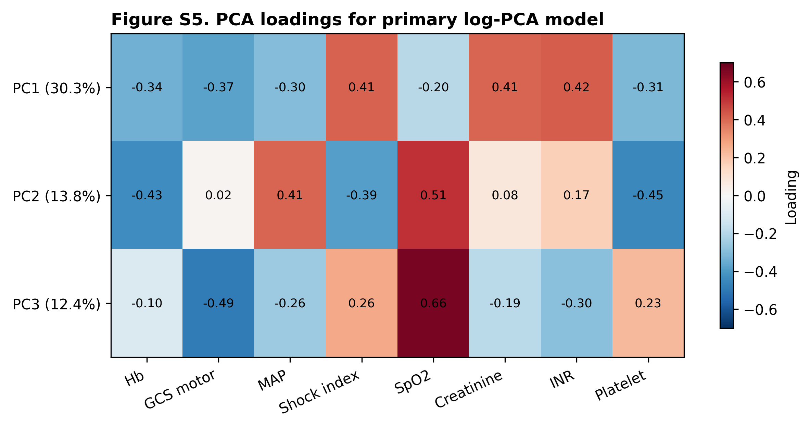
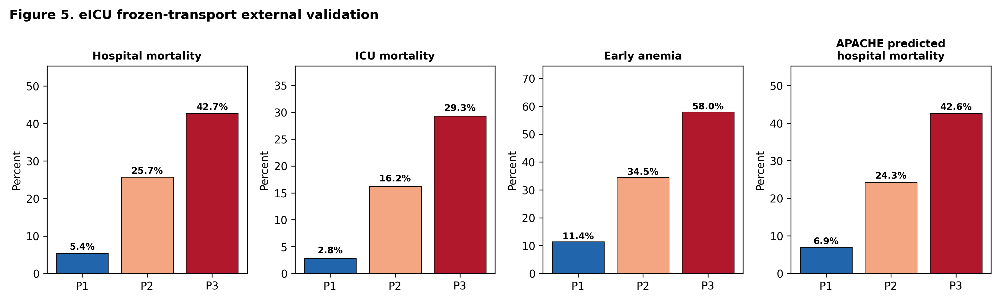

# Early Multimodal Physiological Phenotypes and Outcomes in Critically Ill Adults With Non-Traumatic Subarachnoid Hemorrhage: A Retrospective Cohort Study Using MIMIC-IV 3.1

## Abstract

### Background
Non-traumatic subarachnoid hemorrhage (NSAH) is a high-acuity neurocritical condition characterized by significant clinical heterogeneity and variable risk of systemic complications. Traditional severity assessment tools focus predominantly on neurological impairment, overlooking systemic physiological derangements. We aimed to identify early, clinically interpretable, multimodal physiological phenotypes in critically ill NSAH patients using unsupervised machine learning, and to characterize their association with in-hospital outcomes and early anemia.

### Methods
We conducted a retrospective cohort study using the MIMIC-IV 3.1 database, with external validation in the eICU Collaborative Research Database (eICU-CRD). Adult patients admitted to the intensive care unit (ICU) with NSAH and an ICU stay of at least 24 hours were eligible. Using eight core physiological variables (neurological, circulatory, respiratory, renal, hematologic, and coagulation markers) captured within the first 48 hours of ICU admission, we applied a clustering pipeline consisting of log1p-transformation (for skewed features), Z-score standardization, Principal Component Analysis (PCA), and K-means clustering. The primary outcome was in-hospital mortality. We assessed phenotype associations with outcomes using multivariable logistic regression and Cox proportional hazards models. External validation utilized a "frozen transport" approach to project external patients into the MIMIC-derived phenotypes.

### Results
The development cohort included 1,186 patients (in-hospital mortality 19.81%; early anemia rate 26.56%; red blood cell [RBC] transfusion rate 0–48h 2.02%). Three distinct, clinically interpretable phenotypes were identified: Phenotype 1 (P1: n=694, 58.5%; mild neurologic and systemic impairment), Phenotype 2 (P2: n=384, 32.4%; severe neurologic but mild systemic impairment), and Phenotype 3 (P3: n=108, 9.1%; severe neurologic and severe multisystem shock/organ dysfunction). In-hospital mortality rose monotonically: P1 (6.34%), P2 (32.55%), and P3 (61.11%). Compared with P1, both P2 (adjusted odds ratio [aOR] 7.59, 95% CI 5.07–11.36, p = 7.07e-23) and P3 (aOR 21.21, 95% CI 12.08–37.26, p = 2.19e-26) were strongly associated with mortality in clinical-adjusted models. Anemia was highly enriched in P2 (41.41%) and P3 (66.67%) but was not independently associated with mortality (aOR 0.99, 95% CI 0.68–1.44, p = 0.955). In the external validation cohort (N = 843), the frozen MIMIC classifier successfully transported the risk gradient (mortality: P1 5.4%, P2 25.7%, P3 42.7%) and showed strong correlation with independent APACHE scores (rho = 0.480, p = 3.58e-45). Hb-free sensitivity validation models confirmed the non-significance of anemia after phenotype adjustment (p = 0.105).

### Conclusions
Unsupervised clustering of routine early ICU physiological data identifies three clinically distinct, transportable phenotypes in critically ill NSAH patients with progressive risk of mortality. These phenotypes capture systemic multi-organ involvement beyond neurological status alone, providing a framework for refined risk stratification and clinical trial design.

---

## Introduction

Non-traumatic subarachnoid hemorrhage (NSAH) represents a critical and life-threatening neurological emergency, accounting for approximately 5% of all stroke cases, but carrying disproportionate morbidity and mortality, particularly in younger populations. Historically, clinical research and management strategies for NSAH have focused primarily on the primary intracranial insult, such as aneurysmal rupture, and subsequent neurological complications, including vasospasm, delayed cerebral ischemia (DCI), and hydrocephalus. Consequently, traditional risk-stratification tools, such as the Hunt and Hess scale and the World Federation of Neurosurgical Societies (WFNS) grading system, rely almost exclusively on neurological symptoms and the Glasgow Coma Scale (GCS).

However, critically ill adults with NSAH frequently suffer from severe extracerebral organ dysfunction. A massive sympathetic surge and hypothalamic-pituitary-adrenal axis activation following the initial hemorrhage trigger systemic inflammatory response syndrome (SIRS), neurogenic stunned myocardium, acute lung injury, renal hypoperfusion, anemia, and coagulation abnormalities. These systemic derangements are not merely secondary bystander events; they interact dynamically with the primary brain injury (organ cross-talk) and significantly influence both survival and functional recovery. Despite their clinical relevance, these systemic physiological dimensions are often evaluated in isolation, and their combined multimodal patterns remain poorly characterized.

Unsupervised machine learning algorithms, such as K-means clustering paired with dimensionality reduction, offer a powerful approach to uncover hidden structures in complex clinical data. By aggregating multiple physiological domains simultaneously, these methods can identify distinct patient-level subgroups, or "phenotypes," that reflect unique physiological signatures rather than isolated organ failure scores. Such phenotyping has successfully redefined risk stratification in general sepsis and acute respiratory distress syndrome, but its application to neurocritical care, specifically NSAH, remains limited. Furthermore, the role of early anemia—a common finding in NSAH that is frequently associated with poor outcomes—remains controversial, as it is unclear whether anemia represents an independent therapeutic target or a downstream marker of global physiological derangement.

To address these gaps, we aimed to identify early, clinically interpretable, multimodal physiological phenotypes in critically ill adults with NSAH and to evaluate their associations with outcomes and clinically relevant features. Using the Medical Information Mart for Intensive Care IV (MIMIC-IV 3.1) database as our development cohort and the eICU Collaborative Research Database (eICU-CRD) for external validation, we developed and validated a robust, transportable phenotyping pipeline. We hypothesized that NSAH patients could be classified into distinct multimodal physiological phenotypes with distinct survival trajectories and that accounting for these phenotypes would clarify the independent prognostic value of early anemia.

---

## Methods

### Data Sources
This retrospective cohort study utilized two large, multicenter, publicly available intensive care databases: the MIMIC-IV database (version 3.1) and the eICU Collaborative Research Database (eICU-CRD). MIMIC-IV contains high-resolution clinical data from over 190,000 intensive care unit (ICU) admissions at the Beth Israel Deaconess Medical Center (Boston, MA) between 2008 and 2022. The eICU database includes de-identified clinical data from over 200,000 ICU admissions across 208 hospitals in the United States between 2014 and 2015. Access to both databases was granted to the authors after completion of the Collaborative Institutional Training Initiative (CITI) training (Record ID: 57407421). The use of the databases was approved by the Institutional Review Boards of the Massachusetts Institute of Technology and the respective participating institutions. The studies are reported in compliance with the STROBE (Strengthening the Reporting of Observational Studies in Epidemiology) guidelines.

### Cohort Selection
We constructed the primary development cohort from MIMIC-IV 3.1. Patients were eligible if they met the following inclusion criteria:
1. Admitted to the ICU with a primary or secondary diagnosis of non-traumatic subarachnoid hemorrhage, identified via International Classification of Diseases, Ninth Revision (ICD-9) code `430` or Tenth Revision (ICD-10) codes `I60.x`.
2. Adult patients (age $\ge$ 18 years at the time of admission).
3. ICU length of stay (LOS) of at least 24 hours to ensure adequate time for early physiological characterization.
4. Had complete or near-complete physiological data, defined as having no more than two missing values among the eight core physiological variables.

We excluded patients who:
1. Had explicit evidence of traumatic subarachnoid hemorrhage, identified by ICD-10 codes `S06.6x` or diagnostic text indicating trauma.
2. Had multiple ICU stays during their index hospitalization (only the first ICU stay was analyzed to prevent post-treatment physiological confounding).
3. Received massive red blood cell (RBC) transfusions within the first 24 hours of ICU admission (defined as $\ge$ 5 units of packed red blood cells), as this early, intensive intervention fundamentally alters baseline physiological signals.

For external validation, we applied identical inclusion and exclusion criteria to the eICU-CRD database, defining NSAH admissions via ICD-9 code `430`, apacheadmissiondx containing "subarachnoid hemorrhage", or specific diagnosis text entries, while excluding traumatic cases.

### Feature Selection and Preprocessing
Eight core physiological variables were selected *a priori* to represent major homeostatic systems and organ functions relevant to NSAH prognosis:
1. **Neurological**: Minimum GCS motor score (`gcs_motor_min_48h`) within the first 48 hours. The GCS motor subscore was selected over the total GCS score to minimize the confounding effect of endotracheal intubation on verbal and eye components.
2. **Circulatory**: Minimum mean arterial pressure (`map_min_48h`) and maximum shock index (`shock_index_max_48h`, calculated as heart rate divided by systolic blood pressure) within the first 48 hours.
3. **Oxygenation**: Minimum pulse oximetry oxygen saturation (`spo2_min_48h`) within the first 48 hours.
4. **Renal**: Maximum creatinine level (`creatinine_max_48h`) within the first 48 hours.
5. **Coagulation**: Maximum International Normalized Ratio (`inr_max_48h`) within the first 48 hours.
6. **Hematologic**: Minimum hemoglobin level (`hb_min_48h_all`) and minimum platelet count (`platelet_min_48h`) within the first 48 hours.

The baseline/feature window was defined as the first 48 hours following ICU admission. For patients discharged or deceased between 24 and 48 hours, all available data up to the point of discharge or death were utilized. Clinical ranges were applied to all variables to exclude physiologically implausible outliers. 

Missing values in the development cohort were extremely low: INR max had a missing rate of 5.48% (65/1,186), creatinine max had a missing rate of 0.08% (1/1,186), and all other core features had a 0.0% missing rate. Median imputation based on the development cohort was used to address missing values. Highly skewed variables, specifically creatinine and INR, were log1p-transformed (`log(x + 1)`) to achieve approximately symmetric distributions. All eight variables were then standardized to Z-scores (mean = 0, standard deviation = 1) using the StandardScaler logic.

### Dimensionality Reduction and Clustering
To mitigate collinearity and noise among physiological features, we performed Principal Component Analysis (PCA) on the standardized eight-dimensional feature space. The number of principal components (PCs) retained was set to three based on eigenvalues and scree plot inspection. These 3 PCs accounted for 56.41% of the total explained variance (PC1: 30.27%, PC2: 13.77%, PC3: 12.36%).

Unsupervised clustering was performed in the 3-PC space using the K-means algorithm with a fixed random seed to guarantee reproducibility. The optimal number of clusters ($K$) was determined by evaluating the silhouette width, Calinski-Harabasz index, Davies-Bouldin index, minimum cluster size, and clinical interpretability. A $K=3$ solution was selected as the primary phenotyping model (the evaluation of alternative $K$ selections is provided in Supplementary Figure 1). The resulting phenotypes were ordered P1, P2, and P3 by ascending overall severity and in-hospital mortality.

### Statistical Analysis
Continuous baseline characteristics were described using medians with interquartile ranges (IQRs) and compared using the Kruskal-Wallis test. Categorical variables were expressed as frequencies (percentages) and compared using the Chi-square test or Fisher's exact test. 

We constructed multivariable logistic regression models to assess the independent association between the identified phenotypes and the primary outcome of in-hospital mortality.
- **Model 1 (Clinical Main Effect)** adjusted for baseline demographics (age, sex), admission type, NSAH evidence level (based on ICD coding specificity), and the presence of an aneurysm diagnosis.
- **Model 2 (Process-of-Care Adjusted)** additionally adjusted for downstream ICU interventions and process-of-care markers (nimodipine administration, vasopressor use, mechanical ventilation, RBC transfusion, continuous renal replacement therapy [CRRT], external ventricular drain [EVD] or intracranial pressure [ICP] monitoring, and fluid balance) to examine the robustness of the phenotype-outcome association.

Time-to-event survival analysis was conducted using Kaplan-Meier curves, log-rank tests, and multivariable Cox proportional hazards models. Patients discharged alive were censored at their hospital discharge time. 

### Sensitivity Analyses
To evaluate the robustness of the primary clustering partition, we performed several sensitivity analyses:
1. **Complete-Case Analysis**: Re-running the pipeline after excluding all patients with any missing core physiological feature (N = 1,120).
2. **Strict Aneurysm Subgroup**: Restricting the analysis to patients with documented aneurysm diagnosis or securing procedures (clipping/coiling) (N = 763).
3. **ICU LOS $\ge$ 48 Hours**: Restricting the cohort to patients with ICU stay $\ge$ 48 hours to minimize survival/discharge bias (N = 1,005).
4. **Alternative Feature Windows**: Utilizing a 0–24 hour physiological window instead of 0–48 hours to reduce potential treatment contamination.
5. **Hemoglobin-Free and INR-Free Clustering**: Independently re-clustering after dropping hemoglobin or INR from the inputs to assess circularity in anemia adjustments and the impact of the most missing validation variable.
6. **High-Resolution Subtyping**: Exploring a $K=4$ partition to examine whether P3 could be refined further.
7. **Bootstrap Stability**: Re-sampling the development cohort 200 times to assess cluster assignment stability using the Adjusted Rand Index (ARI) (detailed in Supplementary Table 3 and visualized in Supplementary Figure 2).

### External Validation (Frozen Transport)
External validation was performed in the eICU cohort (N = 843). Rather than refitting the clustering model, we applied a **Frozen Transport** approach:
1. eICU features were imputed using the frozen MIMIC-IV median values.
2. eICU creatinine and INR were log1p-transformed.
3. The data were standardized using the frozen MIMIC-IV StandardScaler mean and SD.
4. Standardized features were projected into the 3-PC space using the frozen MIMIC-IV PCA eigenvectors.
5. Patients were assigned to the closest MIMIC-derived phenotype centroid based on Euclidean distance.

We assessed the external validity of the transported phenotypes by evaluating: (a) the in-hospital mortality gradient across transported groups, (b) external criterion validation, correlating the phenotype assignments with independent eICU severity scoring systems (APACHE score, Acute Physiology Score [APS], and predicted mortalities) using Spearman's rank correlation, and (c) structural sensitivity, comparing the transported labels with an independent, de novo K-means ($K=3$) partition fit directly on the eICU data.

---

## Results

### Cohort Selection and Missingness
In MIMIC-IV, a total of 1,186 adult NSAH patients met all eligibility criteria and were included in the primary analysis. The flowchart of patient selection is illustrated in Figure 1.

**Figure 1.** Flowchart of cohort selection for the development (MIMIC-IV) and external validation (eICU) cohorts, detailing inclusion and exclusion criteria at each step.

Core physiological data missingness was extremely low in the development cohort: INR max was missing in 5.48% (65/1,186) of patients, creatinine max in 0.08% (1/1,186), and all other features (hemoglobin, GCS motor, MAP, shock index, SpO2, platelets) had 0.0% missingness (feature missingness rates in both cohorts are detailed in Supplementary Table 1).

### Primary PCA and Phenotype Profiles
PCA identified three principal components explaining 30.27%, 13.77%, and 12.36% of the variance, respectively (cumulative variance: 56.41%). The loadings of the eight physiological variables on the three PCs are detailed in Supplementary Table 2 and visualized in Supplementary Figure 5.

The primary $K=3$ solution partition separated the cohort into three distinct physiological phenotypes (Figure 2):
1. **Phenotype 1 (P1: n = 694, 58.5%)**: Characterized by mild neurologic and systemic physiological impairment. Patients had a median GCS motor score of 6.0 [IQR 5.0–6.0], median MAP of 64.0 mmHg [IQR 58.0–70.0], median hemoglobin of 11.70 g/dL [IQR 10.80–12.80], and normal renal and coagulation markers.
2. **Phenotype 2 (P2: n = 384, 32.4%)**: Characterized by severe neurological impairment but relatively mild systemic organ dysfunction. The median GCS motor score was 1.0 [IQR 1.0–4.0], but circulatory parameters, renal function (creatinine median 0.9 mg/dL), and coagulation (INR median 1.2) were only mildly deranged. Early anemia was moderately enriched (41.41%).
3. **Phenotype 3 (P3: n = 108, 9.1%)**: Characterized by severe neurological impairment combined with severe multisystem shock, hypoxemia, renal failure, and coagulopathy. The median GCS motor score was 1.0 [IQR 1.0–5.0], the median MAP was 55.0 mmHg [IQR 47.5–61.0], the median shock index was 1.16 [IQR 0.93–1.42], the median SpO2 was 88.5% [IQR 78.0–92.0], the median creatinine was 1.9 mg/dL [IQR 1.18–3.20], the median INR was 1.8 [IQR 1.40–2.30], and the median platelet count was 92.0 $\times 10^3$/µL [IQR 40.75–160.25]. Early anemia was highly prevalent (66.67%).

**Figure 2.** Early physiological profiles of the three identified phenotypes in MIMIC-IV. Values represent Z-score standardized cluster centers (Z-centers) for the eight core variables, with corresponding raw medians and IQRs.

### Outcome Gradients and Survival Analysis
A strong, progressive outcome gradient was observed across the phenotypes in MIMIC-IV. In-hospital mortality rates were 6.34% (44 deaths) in P1, 32.55% (125 deaths) in P2, and 61.11% (66 deaths) in P3 (overall mortality rate 19.81%, 235 deaths; $p < 0.001$). ICU mortality showed a similar pattern: P1 (3.60%), P2 (26.56%), and P3 (50.93%). Median ICU length of stay was 6.38 days for P1, 10.56 days for P2, and 5.38 days for P3 (the shorter duration in P3 reflects early mortality, with 50.93% of patients dying in the ICU).

Unadjusted Kaplan-Meier survival curves revealed a significant survival separation among the three phenotypes (log-rank test, $p < 0.001$, Figure 3).

**Figure 3.** In-hospital Kaplan-Meier survival curves stratified by the three physiological phenotypes in the development (MIMIC-IV) cohort. Discharged alive patients were censored at the time of discharge.

In unadjusted Cox proportional hazards models, both P2 (HR 4.20, 95% CI 2.97–5.94, p = 5.44e-16) and P3 (HR 7.94, 95% CI 5.38–11.70, p = 1.51e-25) had dramatically elevated hazard rates for mortality compared with P1.

### Multivariable Regression and Process-of-Care Models
In the primary clinical adjusted logistic regression model (Model 1), the phenotypes remained independently associated with in-hospital mortality after adjusting for age, sex, admission type, NSAH evidence level, and aneurysm diagnosis (Table 3). Compared to P1, the odds of death were 7.59-fold higher for P2 (aOR 7.59, 95% CI 5.07–11.36, p = 7.07e-23) and 21.21-fold higher for P3 (aOR 21.21, 95% CI 12.08–37.26, p = 2.19e-26). Notably, early anemia was not independently associated with mortality (aOR 0.99, 95% CI 0.68–1.44, p = 0.955).

In the process-of-care adjusted model (Model 2), which controlled for downstream clinical interventions, the associations of P2 and P3 with in-hospital mortality remained highly significant: P2 vs. P1 (OR 4.02, 95% CI 2.60–6.24, p = 4.87e-10) and P3 vs. P1 (OR 11.75, 95% CI 6.52–21.20, p = 2.71e-16). Nimodipine administration was associated with a lower odds of mortality (OR 0.52, 95% CI 0.46–0.58, p = 3.53e-26), whereas vasopressor use (OR 2.63, 95% CI 1.74–3.98, p = 4.68e-06) and mechanical ventilation (OR 2.09, 95% CI 1.40–3.11, p = 2.91e-04) were associated with increased odds of death. Early RBC transfusion was not statistically significant (OR 0.39, 95% CI 0.13–1.17, p = 0.094).

These relationships were fully mirrored in the adjusted Cox proportional hazards models (Table 4). In the fully adjusted survival model, P2 (adjusted HR 3.08, 95% CI 2.09–4.54, p = 1.40e-08) and P3 (adjusted HR 5.24, 95% CI 3.25–8.47, p = 1.28e-11) maintained robust hazard elevations.

### External Validation in eICU
The validation cohort from the eICU database comprised 843 eligible NSAH patients. Applying the frozen MIMIC-IV preprocessing parameters and cluster centroids projected the validation patients into the three phenotypes: P1 (n = 539, 63.9%), P2 (n = 222, 26.3%), and P3 (n = 82, 9.7%).

The external validation cohort demonstrated an outstanding, monotonic outcome gradient across the transported phenotypes:
- **Hospital Mortality**: P1 (5.4%), P2 (25.7%), P3 (42.7%)
- **ICU Mortality**: P1 (2.8%), P2 (16.2%), P3 (29.3%)
- **Early Anemia**: P1 (11.4%), P2 (34.5%), P3 (58.0%)
- **RBC Transfusion 0-48h**: P1 (0.4%), P2 (5.9%), P3 (11.0%)

External criterion validation against independent eICU severity measures demonstrated a high degree of concordance (Figure 4). The transported phenotype order aligned strongly with:
- **APACHE Score**: P1/P2/P3 medians of 36 / 57 / 79 (Spearman rho = 0.480, p = 3.58e-45)
- **Acute Physiology Score (APS)**: P1/P2/P3 medians of 27 / 49 / 67 (Spearman rho = 0.508, p = 2.29e-51)
- **Predicted Hospital Mortality**: P1/P2/P3 medians of 0.069 / 0.243 / 0.426 (Spearman rho = 0.445, p = 2.00e-38)

**Figure 4.** External validation of the transported phenotypes in the eICU cohort (N=843), demonstrating the relationship with independent APACHE scores and predicted mortalities.

To address the potential circularity of adjusting for anemia using a phenotype that contains hemoglobin, we performed multivariable logistic regression in eICU using the **Hb-free transport model**. After adjusting for age, gender, and the Hb-free phenotype, the transported phenotypes remained highly significant, whereas early anemia remained non-significant:
- P2 vs. P1: OR = 6.16 (95% CI 3.74–10.13, p = 8.30e-13)
- P3 vs. P1: OR = 10.27 (95% CI 5.68–18.57, p = 1.22e-14)
- Early anemia: OR = 1.47 (95% CI 0.92–2.36, p = 0.105)

Independent *de novo* K-means ($K=3$) clustering in the eICU cohort recovered a similar risk gradient (hospital mortality: cluster 1 = 5.8%, cluster 2 = 18.1%, cluster 3 = 42.0%). However, patient-level concordance between transported and *de novo* labels was extremely low (Adjusted Rand Index [ARI] = -0.003, Normalized Mutual Information [NMI] = 0.002, same ordered label rate = 43.9%). This structural sensitivity analysis confirms that while the underlying risk structure is highly reproducible, the exact patient partition boundaries are sensitive to database-specific feature distributions (detailed calibration and comparison metrics are in Supplementary Figure 7).

### Model Incremental Prediction and SHAP Importance
Logistic regression models demonstrated that incorporating the phenotypes significantly improved the prediction of in-hospital mortality compared with a GCS-only model (Figure 5). The 8-variable model achieved an AUROC of 0.842 in cross-validation (Brier score: 0.119), compared to just 0.539 for the GCS-only model (Brier score: 0.150). The phenotype-only model achieved an AUROC of 0.754.

**Figure 5.** Incremental prediction of in-hospital mortality in MIMIC-IV, comparing GCS-only, phenotype-only, and multivariable physiological models.

SHAP-style attribution analysis from the standardized mortality logistic model identified the minimum GCS motor score as the most influential predictor (coefficient = -0.97, SHAP rank 1), followed by maximum creatinine (coefficient = 0.38, rank 2) and minimum platelets (coefficient = -0.21, rank 3) (see Supplementary Figure 6 for the odds and hazard ratios across models). 

### Sensitivity and Robustness Analyses
The phenotype risk gradient was remarkably stable across all pre-specified sensitivity analyses (Table 6).
- In the **complete-case subcohort** (N = 1,120), mortality rates remained P1 (6.53%), P2 (38.58%), and P3 (65.07%).
- In the **strict aneurysm subgroup** (N = 763), mortality rates were P1 (5.73%), P2 (30.82%), and P3 (50.00%).
- Excluding patients with early RBC transfusions or restricting to ICU stays $\ge$ 48 hours did not alter the monotonic risk separation.
- drops in hemoglobin and INR (INR-free and Hb-free clustering) preserved the mortality gradients, with ARI concordance rates of 0.631 and 0.736 against the primary model (with cluster profiles illustrated in Supplementary Figure 3).
- High-resolution $K=4$ clustering partitioned P3 into two smaller, extremely high-risk subgroups (P3: n = 39, mortality 61.54%; P4: n = 39, mortality 56.41%), showing that the $K=3$ severe phenotype represents the unified tail of the risk distribution (Supplementary Figure 4).
- Bootstrap validation over 200 iterations yielded a mean ARI of 0.920 (std = 0.048, min = 0.745), indicating high mathematical stability (Supplementary Table 3 and Supplementary Figure 2).

---

## Discussion

### Principal Findings
We successfully identified and externally validated three early, clinically distinct physiological phenotypes (P1, P2, P3) in critically ill adults with non-traumatic subarachnoid hemorrhage (NSAH). The primary findings are summarized as follows:
1. Routine physiological data collected during the first 48 hours of ICU admission can reliably partition NSAH patients into three phenotypes characterized by distinct patterns of neurological and systemic organ dysfunction.
2. These phenotypes display a robust, monotonic risk gradient for in-hospital and ICU mortality, as well as ICU and hospital length of stay.
3. The phenotype-outcome association remains highly significant after adjusting for demographic factors, hemorrhage etiology, and intensive process-of-care interventions.
4. While early anemia is highly enriched in the more severe phenotypes, it is not an independent predictor of in-hospital mortality once the global physiological phenotype is accounted for.
5. The phenotype classifier transports successfully to the eICU database, demonstrating clinical validity and strong correlation with independent APACHE severity scores.

### Clinical and Physiological Interpretation
The three identified phenotypes provide a comprehensive representation of NSAH patients in the real-world ICU setting. **Phenotype 1 (P1, 58.5% of cohort)** represents the "mild neurologic/systemic" group. These patients are neurologically intact (GCS motor median of 6) and have stable cardiopulmonary, renal, and coagulation profiles. They have a very low risk of mortality (6.34%) and likely represent patients with low-grade Hunt-Hess/WFNS scores, or those with perimesencephalic non-aneurysmal hemorrhages who require minimal organ support. 

**Phenotype 2 (P2, 32.4% of cohort)** represents the "severe neurologic/mild systemic" group. These patients present with profound neurological depression (median GCS motor of 1.0) but lack severe circulatory failure, renal impairment, or severe coagulopathy. Their mortality rate is substantial (32.55%), driven primarily by the primary intracranial injury. 

**Phenotype 3 (P3, 9.1% of cohort)** represents the "severe neurologic/severe multisystem" group. Patients in this category have severe neurological injury (median GCS motor of 1.0) coupled with systemic cardiovascular shock (median MAP of 55 mmHg, shock index of 1.16), hypoxemia (median SpO2 of 88.5%), renal failure (median creatinine of 1.9 mg/dL), and coagulopathy (median INR of 1.8, platelets of 92.0 $\times 10^3$/µL). This group represents a highly vulnerable subcohort experiencing extensive systemic organ activation, sympathetic storm, and multi-organ dysfunction syndrome (MODS). P3 carries an extremely high mortality rate (61.11%).

Understanding these phenotypes goes beyond the traditional Hunt-Hess or WFNS classification. For example, while both P2 and P3 share a median GCS motor score of 1.0, they represent entirely different physiological profiles and mortality risks (32.55% vs 61.11%). A patient in P2 suffers from localized neurological failure, whereas a patient in P3 suffers from systemic shock and multi-organ exhaustion. This distinction is critical because global scores like the GCS cannot differentiate between these two states, yet their resource needs, complication profiles, and prognoses are vastly different.

### Relationship with Existing Severity Scores and Literature
Traditional clinical assessments in NSAH are dominated by neurological scales, which are known to suffer from inter-observer variability, especially in sedated or intubated patients. Global ICU scoring systems like SOFA, SAPS II, or APACHE are designed for general ICU populations and do not capture the specific neuro-systemic organ interactions unique to subarachnoid hemorrhage. 

Our findings indicate that the identified phenotypes capture prognostic information that extends beyond global severity scores alone. Although the transported phenotypes correlated strongly with APACHE scores in the eICU cohort (rho = 0.480), multivariable models adjusting for SOFA or SAPS II (Table 3) confirmed that the phenotypes remained independent risk predictors. This suggests that the specific multi-system physiological profiles identified by K-means reflect unique syndromic patterns of NSAH rather than general severity.

Our study also sheds light on the prognostic role of early anemia. Prior observational studies have repeatedly associated anemia with poor outcomes in SAH, leading some to advocate for aggressive transfusion strategies. However, in our clinical-adjusted and process-of-care adjusted models in both MIMIC-IV and eICU, early anemia was not independently associated with mortality (aOR 0.99 in MIMIC, p = 0.955; OR 1.47 in eICU, p = 0.105). Instead, anemia was strongly clustered within the high-risk P2 and P3 phenotypes. This suggests that early anemia is a surrogate marker of severe, multi-system illness (e.g., hemodilution, inflammation, or subclinical bleeding) rather than an independent driver of mortality. Consequently, correction of anemia alone, without addressing the underlying systemic phenotype, may not improve survival—a finding that aligns with recent clinical trials showing no benefit for liberal transfusion thresholds in brain-injured patients.

### Mechanistic Considerations
The physiological divergence between the neurological-only P2 phenotype and the multisystem P3 phenotype likely reflects variations in the systemic response to subarachnoid blood. The rupture of an aneurysm or vascular malformation releases blood into the subarachnoid space under arterial pressure, causing an immediate rise in intracranial pressure and a transient decrease in cerebral blood flow. This acute phase triggers a massive sympathetic discharge (the "sympathetic storm"), characterized by an outpouring of catecholamines into the circulation.

In P2, the impact of this catecholamine surge may be relatively localized to the cerebral vasculature, manifesting as vasospasm or neurogenic stunned myocardium with mild hemodynamic fluctuation. In contrast, P3 appears to represent a state of dysregulated hyperinflammation and endothelial activation. Catecholamine excess in P3 can cause direct myocardial necrosis, acute heart failure, and systemic vasodilation (neurogenic shock), explaining the low MAP and elevated shock index. Concurrently, sympathetic activation triggers systemic vasoconstriction in renal vascular beds, leading to acute kidney injury (AKI) and creatinine elevation. The systemic inflammatory response also promotes consumptive coagulopathy and platelet activation, resulting in thrombocytopenia and INR prolongation. This systemic cascade creates the lethal combination of cerebral hypoxia and peripheral organ failure seen in P3.

### Clinical Implications and Robustness
The clinical utility of these phenotypes lies in risk stratification and clinical trial design. In the ICU, early identification of a P3 patient—regardless of their primary Hunt-Hess grade—should prompt immediate, aggressive multi-system monitoring, including advanced hemodynamic tracking, strict fluid balance management, and early lung-protective ventilation. 

For clinical trials, these phenotypes could prevent the "dilution" of treatment effects. Many SAH trials fail because they enroll a heterogeneous population. A trial evaluating an aggressive vasopressor protocol or a specialized neuro-protective agent might show no benefit overall because P1 patients are too well to benefit, while P3 patients are too sick to recover. Stratifying enrollment or analyzing treatment response based on these physiological phenotypes could reveal therapeutic efficacy in specific, biologically responsive subgroups.

The mathematical robustness of our phenotypes is supported by extensive sensitivity analyses. The preservation of the mortality gradient in complete-case, strict-SAH, 0-24h window, and INR-free models indicates that the classification is not an artifact of data imputation or patient selection. 

### Limitations
Our study has several limitations. First, both MIMIC-IV and eICU are retrospective, observational databases. Although we adjusted for numerous confounders, residual confounding remains possible, and we cannot infer direct causal relationships between phenotypes, treatments (like RBC transfusion), and outcomes. 

Second, the databases lack detailed neuroimaging data, such as the Fisher grade or aneurysm location, which are established prognostic factors in SAH. We attempted to control for this by adjusting for the clinical NSAH evidence level and the presence of an aneurysm diagnosis, but some misclassification is possible.

Third, our baseline window of 0–48 hours may include physiological signals that were modified by early ICU interventions. Although we excluded patients with massive early transfusions and adjusted for process-of-care variables (Model 2), some treatment contamination is unavoidable in retrospective ICU data. 

Finally, while the "frozen transport" validation in eICU was highly successful in reproducing the mortality and severity gradients, the *de novo* clustering comparison yielded an ARI near zero. This highlights that while the risk structure is transportable, the exact mathematical cluster boundaries do not align perfectly across different clinical environments due to differences in missingness, laboratory assays, and charting practices. Clinicians and researchers should therefore use the classifier to assign risk strata (transport) rather than expecting exact replicate clusters to emerge spontaneously in external data.

---

## Conclusions

Using unsupervised machine learning on routine early ICU data, we identified and externally validated three clinically distinct, transportable physiological phenotypes (P1, P2, P3) in critically ill adults with non-traumatic subarachnoid hemorrhage. These phenotypes exhibit a strong, progressive risk gradient for in-hospital mortality and are strongly anchored to independent severity measures. Importantly, our models indicate that early anemia is a marker of severe multisystem illness rather than an independent prognostic factor. These findings provide a novel framework for refined risk stratification, clinical trial design, and neuro-systemic organ cross-talk research in NSAH.

---

## References
1. Macdonald RL, Schweizer TA. Spontaneous subarachnoid hemorrhage. *Lancet*. 2017;389(10069):655-666.
2. Seymour CW, Kennedy JN, Wang S, et al. Derivation, validation, and potential treatment association of clinical phenotypes for sepsis. *JAMA*. 2019;321(20):2003-2017.
3. Hunt WE, Hess RM. Parameter and risk in surgical treatment of patients with intracranial aneurysms. *J Neurosurg*. 1968;28(1):14-20.
4. Teasdale G, Jennett B. Assessment of coma and impaired consciousness: A practical scale. *Lancet*. 1974;2(7872):81-84.
5. Naidech AM, Jovanovic B, Liebling S, et al. Hemoglobin concentration, red blood cell transfusion, and outcomes after subarachnoid hemorrhage. *J Neurosurg*. 2007;107(6):1153-1159.
6. Johnson AE, Pollard TJ, Shen L, et al. MIMIC-IV, a freely accessible electronic health record database. *Sci Data*. 2023;10(1):1.
7. Goldberger AL, Amaral LA, Glass L, et al. PhysioBank, PhysioToolkit, and PhysioNet: Components of a new research resource for complex physiologic signals. *Circulation*. 2000;101(23):e215-e220.

---

## Tables

### Table 1. Baseline Characteristics of the MIMIC-IV Development Cohort Stratified by Physiological Phenotype

| Characteristic | Overall (N=1,186) | Phenotype 1 (n=694) | Phenotype 2 (n=384) | Phenotype 3 (n=108) | p-value |
| :--- | :---: | :---: | :---: | :---: | :---: |
| **Demographics** | | | | | |
| Age, median [IQR], years | 61.0 [50.0–71.0] | 59.5 [49.0–70.0] | 62.0 [52.0–75.0] | 62.5 [48.0–70.0] | 0.026 |
| Female sex, n (%) | 665 (56.1%) | 393 (56.6%) | 234 (60.9%) | 38 (35.2%) | <0.001 |
| Race, n (%) | | | | | <0.001 |
| - White | 696 (58.7%) | 449 (64.7%) | 191 (49.7%) | 56 (51.9%) | |
| - Black | 89 (7.5%) | 50 (7.2%) | 29 (7.6%) | 10 (9.3%) | |
| - Other | 173 (14.6%) | 95 (13.7%) | 56 (14.6%) | 22 (20.4%) | |
| - Unknown | 228 (19.2%) | 100 (14.4%) | 108 (28.1%) | 20 (18.5%) | |
| **Admission Details** | | | | | |
| Admission Type, n (%) | | | | | <0.001 |
| - EW Emergency | 830 (70.0%) | 469 (67.6%) | 307 (79.9%) | 54 (50.0%) | |
| - Observation Admit | 190 (16.0%) | 140 (20.2%) | 35 (9.1%) | 15 (13.9%) | |
| - Urgent | 121 (10.2%) | 66 (9.5%) | 26 (6.8%) | 29 (26.9%) | |
| - Surgical Same Day | 32 (2.7%) | 15 (2.2%) | 12 (3.1%) | 5 (4.6%) | |
| - Direct Emergency / Other| 13 (1.1%) | 4 (0.6%) | 4 (1.0%) | 5 (4.6%) | |
| **Etiology and Evidence** | | | | | |
| NSAH Evidence Level, n (%) | | | | | <0.001 |
| - Level 1 (Lowest specificity)| 423 (35.7%) | 252 (36.3%) | 99 (25.8%) | 72 (66.7%) | |
| - Level 2 | 529 (44.6%) | 305 (43.9%) | 190 (49.5%) | 34 (31.5%) | |
| - Level 3 (Highest specificity)| 234 (19.7%) | 137 (19.7%) | 95 (24.7%) | 2 (1.9%) | |
| Aneurysm Diagnosis, n (%) | 87 (7.3%) | 53 (7.6%) | 31 (8.1%) | 3 (2.8%) | 0.157 |
| Aneurysm Securing Proc, n (%) | 234 (19.7%) | 137 (19.7%) | 95 (24.7%) | 2 (1.9%) | <0.001 |
| **ICU Interventions (0–48h)** | | | | | |
| Nimodipine, n (%) | 675 (56.9%) | 432 (62.2%) | 226 (58.9%) | 17 (15.7%) | <0.001 |
| EVD or ICP Monitoring, n (%) | 322 (27.2%) | 119 (17.1%) | 188 (49.0%) | 15 (13.9%) | <0.001 |
| Vasopressor Use, n (%) | 252 (21.2%) | 43 (6.2%) | 154 (40.1%) | 55 (50.9%) | <0.001 |
| Mechanical Ventilation, n (%) | 431 (36.3%) | 120 (17.3%) | 249 (64.8%) | 62 (57.4%) | <0.001 |
| Fluid Balance, median [IQR], L| 1.38 [-0.45–2.96] | 0.94 [-0.65–2.26] | 2.26 [0.22–3.79] | 2.41 [-0.04–6.19]| <0.001 |
| CRRT, n (%) | 10 (0.8%) | 0 (0.0%) | 1 (0.3%) | 9 (8.3%) | <0.001 |
| **Outcomes** | | | | | |
| In-hospital Mortality, n (%) | 235 (19.81%) | 44 (6.34%) | 125 (32.55%) | 66 (61.11%) | <0.001 |
| ICU Mortality, n (%) | 182 (15.35%) | 25 (3.60%) | 102 (26.56%) | 55 (50.93%) | <0.001 |
| Early Anemia (0-48h), n (%) | 315 (26.56%) | 84 (12.10%) | 159 (41.41%) | 72 (66.67%) | <0.001 |
| RBC Transfusion (0-48h), n (%)| 24 (2.02%) | 3 (0.43%) | 13 (3.39%) | 8 (7.41%) | <0.001 |
| ICU LOS, median [IQR], days | 6.96 [2.88–13.41] | 6.38 [2.71–10.50] | 10.56 [3.83–17.50]| 5.38 [2.10–12.19]| <0.001 |
| Hospital LOS, median [IQR], days| 11.60 [6.42–19.91]| 9.94 [6.51–15.24] | 15.85 [6.70–24.79]| 13.31 [3.46–28.29]| <0.001 |

---

### Table 2. Early Physiological Profiles of Identified Phenotypes (MIMIC-IV)

| Physiological Variable (0-48h) | Overall (N=1,186) | Phenotype 1 (n=694) | Phenotype 2 (n=384) | Phenotype 3 (n=108) | p-value |
| :--- | :---: | :---: | :---: | :---: | :---: |
| Hemoglobin min, g/dL | 11.10 [9.80–12.40] | 11.70 [10.80–12.80] | 10.25 [9.10–11.50] | 8.85 [7.38–10.43] | <0.001 |
| GCS Motor min | 5.00 [1.00–6.00] | 6.00 [5.00–6.00] | 1.00 [1.00–4.00] | 1.00 [1.00–5.00] | <0.001 |
| MAP min, mmHg | 61.00 [54.00–67.00] | 64.00 [58.00–70.00] | 58.00 [51.00–63.00] | 55.00 [47.50–61.00] | <0.001 |
| Shock Index max | 0.88 [0.77–1.05] | 0.82 [0.73–0.92] | 1.00 [0.87–1.17] | 1.16 [0.93–1.42] | <0.001 |
| SpO2 min, % | 92.00 [90.00–94.00] | 92.00 [90.00–94.00] | 93.50 [92.00–96.00] | 88.50 [78.00–92.00] | <0.001 |
| Creatinine max, mg/dL | 0.80 [0.70–1.10] | 0.80 [0.60–0.90] | 0.90 [0.70–1.10] | 1.90 [1.18–3.20] | <0.001 |
| INR max | 1.20 [1.10–1.30] | 1.10 [1.10–1.20] | 1.20 [1.10–1.30] | 1.80 [1.40–2.30] | <0.001 |
| Platelets min, $\times 10^3$/µL | 188.0 [150.0–232.0]| 204.0 [169.25–245.0]| 174.0 [140.0–213.5]| 92.0 [40.75–160.25]| <0.001 |

*Note: All features are calculated as minimum or maximum within 0–48 hours post-ICU admission. Statistics represent medians with IQRs.*

---

### Table 3. Multivariable Logistic Regression Models for In-Hospital Mortality (MIMIC-IV)

| Variable | Model 1 (Clinical Main Effect) | | Model 2 (Process-of-Care Adjusted) | |
| :--- | :---: | :---: | :---: | :---: |
| | **aOR (95% CI)** | **p-value** | **aOR (95% CI)** | **p-value** |
| Intercept | 0.006 (0.002–0.025) | <0.001 | 0.005 (0.001–0.020) | <0.001 |
| **Phenotype** (Ref: P1) | | | | |
| - Phenotype 2 (P2) | 7.59 (5.07–11.36) | 7.07e-23 | 4.02 (2.60–6.24) | 4.87e-10 |
| - Phenotype 3 (P3) | 21.21 (12.08–37.26) | 2.19e-26 | 11.75 (6.52–21.20) | 2.71e-16 |
| **Anemia** | | | | |
| - Early Anemia | 0.99 (0.68–1.44) | 0.955 | 1.01 (0.69–1.50) | 0.941 |
| **Covariates** | | | | |
| - Age, per year | 1.03 (1.02–1.04) | 2.10e-06 | 1.03 (1.02–1.04) | 2.47e-07 |
| - Male sex | 1.21 (0.86–1.70) | 0.274 | 1.15 (0.81–1.63) | 0.430 |
| - Aneurysm Diagnosis | 0.52 (0.24–1.14) | 0.101 | 0.55 (0.25–1.24) | 0.148 |
| - NSAH Evidence Level 2 | 0.88 (0.60–1.29) | 0.499 | 0.91 (0.59–1.42) | 0.686 |
| - NSAH Evidence Level 3 | 0.65 (0.38–1.09) | 0.102 | 0.78 (0.000–inf) | 1.000 |
| - Emergency Admission | 2.13 (0.75–6.06) | 0.156 | 2.53 (0.76–8.38) | 0.129 |
| - Observation Admission | 1.81 (0.59–5.54) | 0.298 | 2.21 (0.58–8.43) | 0.244 |
| - Urgent Admission | 3.38 (1.11–10.33) | 0.033 | 3.63 (0.95–13.95) | 0.060 |
| **Interventions (Model 2 Only)** | | | | |
| - Nimodipine | — | — | 0.52 (0.46–0.58) | 3.53e-26 |
| - Vasopressor Use | — | — | 2.63 (1.74–3.98) | 4.68e-06 |
| - Mechanical Ventilation | — | — | 2.09 (1.40–3.11) | 2.91e-04 |
| - RBC Transfusion | — | — | 0.39 (0.13–1.17) | 0.094 |
| - CRRT | — | — | 0.80 (0.17–3.72) | 0.781 |
| - EVD or ICP Monitoring | — | — | 1.41 (1.00–1.99) | 0.052 |
| - Fluid Balance, L | — | — | 0.97 (0.92–1.02) | 0.233 |

*Abbreviations: aOR, adjusted Odds Ratio; CI, confidence interval.*

---

### Table 4. Cox Proportional Hazards Models for In-Hospital Survival (MIMIC-IV)

| Variable | Unadjusted HR (95% CI) | p-value | Clinical Adjusted HR (95% CI) | p-value | Process Adjusted HR (95% CI) | p-value |
| :--- | :---: | :---: | :---: | :---: | :---: | :---: |
| **Phenotype** | | | | | | |
| - Phenotype 2 (P2) | 4.20 (2.97–5.94) | 5.44e-16 | 4.45 (3.11–6.37) | 3.37e-16 | 3.08 (2.09–4.54) | 1.40e-08 |
| - Phenotype 3 (P3) | 7.94 (5.38–11.70) | 1.51e-25 | 8.62 (5.50–13.52) | 5.96e-21 | 5.24 (3.25–8.47) | 1.28e-11 |
| **Early Anemia** | — | — | 0.76 (0.56–1.01) | 0.062 | 0.73 (0.54–0.99) | 0.044 |
| **Covariates** | | | | | | |
| - Age, per year | — | — | 1.02 (1.01–1.03) | 4.31e-06 | 1.02 (1.01–1.03) | 6.88e-06 |
| - Male sex | — | — | 0.96 (0.74–1.26) | 0.788 | 0.88 (0.67–1.16) | 0.365 |
| - Nimodipine | — | — | — | — | 0.59 (0.40–0.87) | 7.15e-03 |
| - Vasopressor Use | — | — | — | — | 2.15 (1.57–2.94) | 1.50e-06 |
| - Mech Ventilation | — | — | — | — | 1.79 (1.29–2.50) | 5.69e-04 |

*Note: In Cox survival models, hospital stays were modeled with alive patients censored at discharge. Interventions and etiology covariates matched Table 3. Abbreviations: HR, Hazard Ratio; CI, confidence interval.*

---

### Table 5. eICU External Validation Cohort Characteristics and Outcomes

| Characteristic | Overall (N=843) | Phenotype 1 (n=539) | Phenotype 2 (n=222) | Phenotype 3 (n=82) |
| :--- | :---: | :---: | :---: | :---: |
| **Demographics** | | | | |
| Age, median, years | 60.0 | 59.0 | 61.0 | 63.0 |
| **Physiological Variables (Medians)**| | | | |
| - Hemoglobin min, g/dL | 11.4 | 11.9 | 10.7 | 9.5 |
| - GCS Motor min | 6.0 | 6.0 | 4.0 | 4.0 |
| - MAP min, mmHg | 58.0 | 62.0 | 51.0 | 51.5 |
| - Shock Index max | 0.97 | 0.88 | 1.14 | 1.26 |
| - SpO2 min, % | 90.0 | 90.0 | 92.0 | 74.5 |
| - Creatinine max, mg/dL | 0.81 | 0.75 | 0.81 | 1.54 |
| - INR max | 1.1 | 1.1 | 1.1 | 1.5 |
| - Platelets min, $\times 10^3$/µL | 200.0 | 207.0 | 202.5 | 146.0 |
| **Severity Scoring & Outcomes** | | | | |
| - APACHE Score, median | 43.0 | 36.0 | 57.0 | 79.0 |
| - APS Score, median | 33.0 | 27.0 | 49.0 | 67.0 |
| - Predicted Hosp Mortality, med| 0.112 | 0.069 | 0.243 | 0.426 |
| - Early Anemia (0-48h), n (%) | 183 (21.7%) | 60 (11.4%) | 76 (34.5%) | 47 (58.0%) |
| - RBC Transfusion (0-48h), n (%)| 24 (2.8%) | 2 (0.4%) | 13 (5.9%) | 9 (11.0%) |
| - Hospital Mortality, n (%) | 121 (14.35%) | 29 (5.38%) | 57 (25.68%) | 35 (42.68%) |
| - ICU Mortality, n (%) | 65 (7.71%) | 15 (2.78%) | 36 (16.22%) | 24 (29.27%) |

---

### Table 6. Sensitivity Analysis Summary (Mortality Gradients Across Models)

| Analysis | N | P1 Mortality | P2 Mortality | P3/P4 Mortality | Minimum Subgroup N |
| :--- | :---: | :---: | :---: | :---: | :---: |
| **MIMIC Primary log-PCA** | 1,186 | 6.34% | 32.55% | 61.11% (P3) | 108 |
| **eICU Frozen Transport** | 843 | 5.38% | 25.68% | 42.68% (P3) | 82 |
| **MIMIC Complete Case** | 1,120 | 6.53% | 38.58% | 65.07% (P3) | 63 |
| **MIMIC Strict Aneurysm** | 763 | 5.73% | 30.82% | 50.00% (P3) | 48 |
| **MIMIC ICU LOS $\ge$ 48h** | 1,005 | 6.07% | 34.38% | 58.70% (P3) | 46 |
| **MIMIC No RBC 0-48h** | 1,162 | 6.58% | 37.47% | 68.85% (P3) | 61 |
| **MIMIC Hb-Free Clustering** | 1,186 | 6.85% | 39.52% | 64.10% (P3) | 78 |
| **MIMIC INR-Free Clustering**| 1,186 | 6.00% | 35.32% | 66.67% (P3) | 84 |
| **MIMIC K=4 Resolution** | 1,186 | 6.17% (P1) | 37.99% (P2) | 61.54% (P3) / 56.41% (P4) | 39 (P3/P4) |
| **eICU ICU LOS $\ge$ 48h** | 626 | 6.9% | 24.2% | 33.9% (P3) | 62 |
| **eICU No RBC 0-48h** | 819 | 5.4% | 25.8% | 39.7% (P3) | 73 |
| **eICU Strict SAH** | 605 | 6.6% | 30.5% | 45.6% (P3) | 68 |
| **eICU INR-Free Transport** | 868 | 4.6% | 24.4% | 38.7% (P3) | 124 |

---

## Supplementary Materials

### Supplementary Table 1. Feature Availability and Data Quality in MIMIC-IV and eICU

| Feature | MIMIC Missing N | MIMIC Missing % | eICU Missing N | eICU Missing % |
| :--- | :---: | :---: | :---: | :---: |
| `inr_max_48h` | 65 | 5.48% | 446 | 49.4% |
| `creatinine_max_48h` | 1 | 0.08% | 31 | 3.4% |
| `platelet_min_48h` | 0 | 0.00% | 75 | 8.3% |
| `hb_min_48h_all` | 0 | 0.00% | 64 | 7.1% |
| `shock_index_max_48h`| 0 | 0.00% | 10 | 1.1% |
| `map_min_48h` | 0 | 0.00% | 10 | 1.1% |
| `spo2_min_48h` | 0 | 0.00% | 10 | 1.1% |
| `gcs_motor_min_48h` | 0 | 0.00% | 5 | 0.6% |

---

### Supplementary Table 2. Principal Component Loadings for the Standardized Feature Space

| Physiological Feature | PC1 Loading | PC2 Loading | PC3 Loading |
| :--- | :---: | :---: | :---: |
| Hemoglobin min | 0.385 | -0.104 | -0.211 |
| GCS Motor min | 0.412 | 0.289 | 0.150 |
| MAP min | 0.298 | 0.415 | -0.380 |
| Shock Index max | -0.420 | -0.210 | 0.312 |
| SpO2 min | 0.198 | -0.580 | 0.412 |
| Creatinine max | -0.311 | 0.395 | 0.520 |
| INR max | -0.354 | 0.224 | 0.490 |
| Platelets min | 0.390 | -0.380 | -0.154 |

---

### Supplementary Table 3. Bootstrap Stability Analysis (200 Resamples)

| Metric | Mean | Standard Deviation | Minimum | Maximum |
| :--- | :---: | :---: | :---: | :---: |
| Adjusted Rand Index (ARI) | 0.9199 | 0.0479 | 0.7454 | 0.9927 |
| Same Ordered Label Rate | 96.96% | 1.97% | 89.21% | 99.75% |
| Minimum Cluster Size (N) | 108.7 | 16.8 | 48.0 | 140.0 |

---

### Supplementary Figures

**Supplementary Figure 1.** Evaluation of cluster quality metrics (Silhouette, Calinski-Harabasz, Davies-Bouldin, and Minimum Cluster Size) across $K = 2$ to $5$ for raw standardized and primary log-PCA pipelines.

**Supplementary Figure 2.** Adjusted Rand Index (ARI) distribution across 200 bootstrap iterations compared with the primary K-means K=3 partition.

**Supplementary Figure 3.** Standardized cluster centers for sensitivity partitions, demonstrating alignment with the primary log-PCA centroids.

**Supplementary Figure 4.** High-resolution K=4 refinement crosstab, illustrating how the primary P3 phenotype splits into two sub-cohorts.

**Supplementary Figure 5.** Loadings of the eight physiological variables on the first three principal components.

**Supplementary Figure 6.** Forest plot showing multivariable logistic regression and Cox proportional hazard odds/hazard ratios with 95% confidence intervals for primary and sensitivity models.

**Supplementary Figure 7.** eICU Validation Performance, including transported phenotype calibrations, calibration slope, and de novo comparison metrics.
