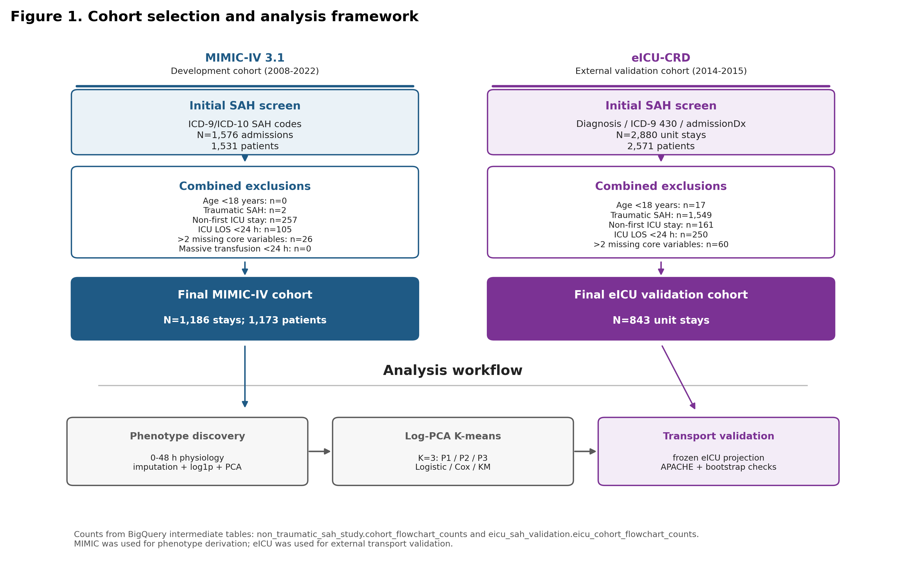
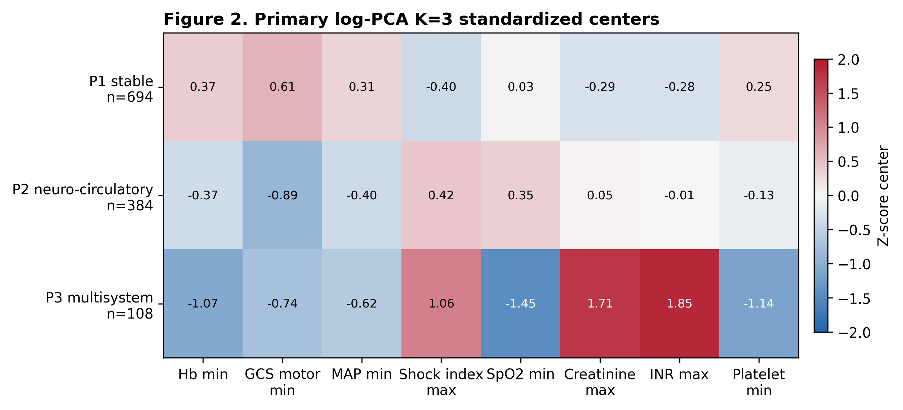
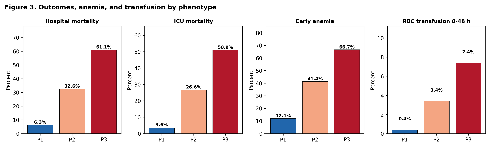
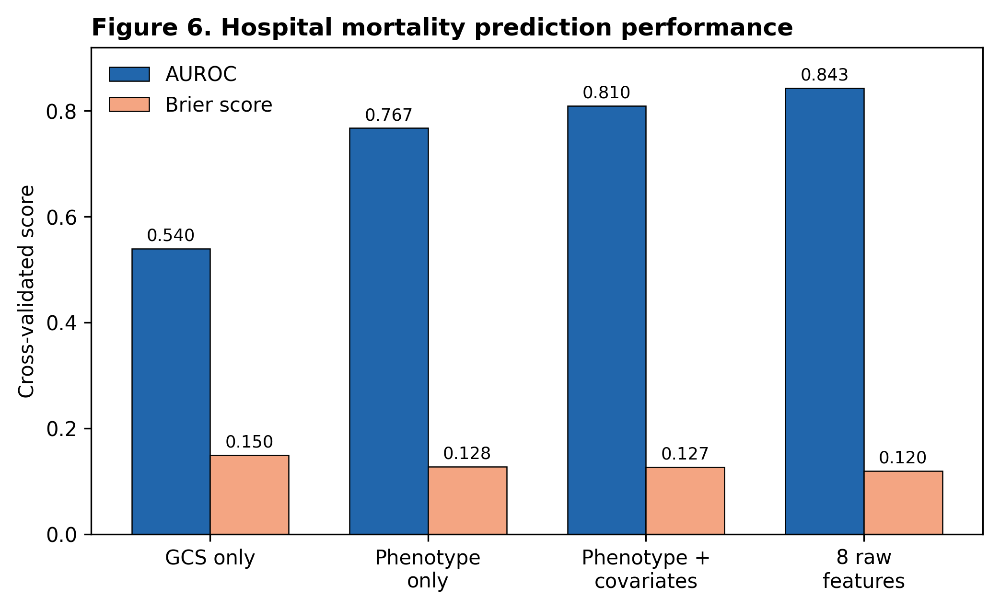

# 重症非创伤性蛛网膜下腔出血成人患者的早期生理表型与结局

## Take-home message

在重症非创伤性蛛网膜下腔出血成人患者中，入 ICU 后前 48 小时的 8 个常规生理变量可识别出三种可复现的神经-全身生理表型，并呈现递增死亡风险。MIMIC 衍生分类器迁移至 eICU 后仍保留该风险梯度。早期贫血富集于高危表型，但在调整表型后并非住院死亡的独立预测因素。

## 结构式摘要

### 目的

非创伤性蛛网膜下腔出血（NSAH）可诱发全身器官功能障碍，而这一部分风险不能被传统神经量表完全捕捉。本研究旨在识别重症 NSAH 成人患者的早期、可迁移生理表型，并评估其与死亡率及早期贫血的关联。

### 方法

本回顾性队列研究以 MIMIC-IV 3.1 为开发队列，以 eICU 合作研究数据库为外部验证队列。纳入 ICU 住院时间 ≥24 小时的成年 NSAH 患者。预先选择入 ICU 后前 48 小时的 8 个变量，覆盖神经、循环、氧合、肾脏、血液和凝血维度。偏态变量经 log1p 转换后进行标准化、主成分分析和 K-means 聚类。外部验证采用冻结的 MIMIC 预处理参数、主成分载荷和聚类质心。

### 结果

开发队列纳入 1,186 例患者。研究识别出三种表型：P1 为轻度神经-全身损伤型（n=694）；P2 为重度神经损伤但全身功能障碍有限型（n=384）；P3 为重度神经损伤合并多系统休克/器官功能障碍型（n=108）。住院死亡率从 P1 的 6.34% 升至 P2 的 32.55% 和 P3 的 61.11%。与 P1 相比，P2 和 P3 的调整后死亡比值比分别为 7.59（95% CI 5.07–11.36）和 21.21（95% CI 12.08–37.26）。早期贫血富集于严重表型，但在调整表型后与死亡率无独立关联。eICU 队列（N=843）中，迁移表型保留了死亡风险梯度（5.4%、25.7%、42.7%）。

### 结论

常规早期 ICU 生理数据可识别出具有递增死亡风险的可迁移 NSAH 生理表型。这些结果支持神经-全身风险分层和未来表型分层研究，但不能用于治疗效应推断。

**关键词：** 蛛网膜下腔出血；重症医学；临床表型；无监督学习；外部验证。

## 引言

非创伤性蛛网膜下腔出血（NSAH）是一类高急症神经系统疾病，具有较高死亡率和长期致残风险。临床风险评估传统上依赖 Hunt-Hess、WFNS 和格拉斯哥昏迷评分（GCS）等神经量表。这些工具仍具有重要临床价值，但难以完整反映急性出血后常见的全身生理反应。

NSAH 早期可诱发交感神经激活、全身炎症、心肺功能障碍、肾脏低灌注、贫血和凝血异常。这些脑外器官紊乱可与原发脑损伤相互作用，并造成显著的预后异质性。APACHE 和 SOFA 等通用 ICU 评分可以概括整体疾病严重程度，但并非为识别 NSAH 特异性的神经-全身模式而设计。

无监督表型分析可以在异质性危重病综合征中识别具有临床意义的亚组。该方法已用于脓毒症和急性呼吸窘迫综合征研究，但在神经重症中的应用仍相对有限。我们假设，早期多模态生理信息可将重症 NSAH 患者划分为具有梯度死亡风险的表型；在纳入全局生理表型后，早期贫血的独立预后信息有限；MIMIC 衍生分类器迁移至外部 ICU 数据库后仍可保留风险梯度。

## 方法

### 研究设计和数据源

本研究为回顾性队列研究，使用两个公开去标识化 ICU 数据库：MIMIC-IV 3.1 和 eICU-CRD 2.0。MIMIC-IV 作为开发队列，eICU-CRD 作为外部验证队列。作者完成 Collaborative Institutional Training Initiative 培训和数据使用要求后获得数据库访问权限。由于两个数据库均为公开去标识化研究资源，患者知情同意在原始数据库治理框架下被豁免；本地伦理表述需由投稿机构按期刊要求最终确认。本研究遵循 STROBE 报告规范，清单拟作为电子补充材料提交。

### 研究队列

纳入收治入 ICU 的成年 NSAH 患者，要求 ICU 住院时间至少 24 小时，且 8 个核心生理变量中缺失值不超过 2 个。MIMIC 患者通过 ICD-9 代码 430 或 ICD-10 I60.x 识别。eICU 患者通过 ICD-9 代码 430、入院诊断文本包含 subarachnoid hemorrhage 或诊断表中符合 NSAH 的条目识别。排除创伤性蛛网膜下腔出血、同次住院多次 ICU 入住，以及入 ICU 后 24 小时内大量红细胞输注者（操作性定义为 ≥5 单位）。最后一项排除用于减少早期强干预对基线血红蛋白、血流动力学和凝血信号的改写。

### 变量和预处理

预先选择入 ICU 后前 48 小时内的 8 个变量：最低 GCS 运动评分、最低平均动脉压、最大休克指数、最低血氧饱和度、最大肌酐、最大国际标准化比值、最低血红蛋白和最低血小板计数。所有变量均应用临床合理范围过滤。缺失值使用开发队列中位数插补。肌酐和国际标准化比值因右偏分布进行 log1p 转换。所有变量使用开发队列均值和标准差进行标准化。

### 表型推导与验证

在标准化后的 8 变量矩阵上进行主成分分析。保留 3 个主成分，累计解释 56.41% 的变异。在 3 个主成分空间中使用 K-means 聚类，设置 `random_state = 42` 和 `n_init = 100`。根据聚类质量指标、最小簇样本量、bootstrap 稳定性和临床可解释性选择 K=3。表型按死亡率递增排序。

外部验证采用冰冻迁移方法。eICU 数据使用 MIMIC 中位数插补，使用 MIMIC 参数完成转换和标准化，并通过 MIMIC 主成分载荷投影到相同空间，随后按最近 MIMIC 表型质心分配标签。迁移表型通过死亡率和 eICU 独立严重程度评分进行验证。eICU de novo 聚类仅作为结构敏感性分析。

### 结局和统计分析

主要结局为住院死亡率。次要结局包括 ICU 死亡率、住院时间、早期贫血和红细胞输注。多因素 Logistic 回归用于评估表型与住院死亡率的关联。主要模型调整年龄、性别、入院类型、NSAH 证据等级、动脉瘤诊断和早期贫血。诊疗过程模型进一步纳入尼莫地平、血管活性药物、机械通气、红细胞输注、肾脏替代治疗、EVD/ICP 监测和液体平衡。过程变量仅解释为探索性严重程度和治疗选择标记，不用于因果治疗效应推断。Cox 模型作为住院死亡时间的敏感性分析。敏感性分析包括完整病例、严格动脉瘤亚组、ICU 住院 ≥48 小时、0–24 小时窗口、无血红蛋白、无 INR、K=4 和 200 次 bootstrap 稳定性分析。

## 结果

### 队列和表型结构

MIMIC 开发队列纳入 1,186 例成人患者。总体住院死亡率为 19.81%，早期贫血率为 26.56%，48 小时内红细胞输注率为 2.02%。开发队列缺失率较低，最大 INR 缺失率为 5.48%，其余核心变量缺失率均不超过 0.08%。

K=3 方案识别出三种临床可解释的表型（图 1 和图 2）。P1 包括 694 例患者（58.5%），表现为轻度神经和全身损伤。P2 包括 384 例患者（32.4%），表现为重度神经损伤但全身生理相对保留。P3 包括 108 例患者（9.1%），表现为重度神经损伤合并低血压、休克指数升高、低氧血症、肾功能障碍、凝血异常、血小板减少和较低血红蛋白。

**图 1.** 队列筛选和分析框架。人数来自 BigQuery 中间队列流程表。下方模块概括 MIMIC 表型推导和 eICU 冰冻迁移。

**图 2.** MIMIC 衍生三种表型的早期生理特征。数值表示标准化聚类中心，并附原始中位数和四分位距。

### 结局和贫血

死亡率随表型呈单调递增（图 3）。P1、P2 和 P3 的住院死亡率分别为 6.34%、32.55% 和 61.11%。ICU 死亡率呈相同模式，分别为 3.60%、26.56% 和 50.93%。未调整 Cox 分析中，与 P1 相比，P2 和 P3 的住院死亡风险比分别为 4.20（95% CI 2.97–5.94）和 7.94（95% CI 5.38–11.70）。

**图 3.** MIMIC-IV 中结局、贫血和早期红细胞输注梯度。红细胞输注仅作为描述性过程变量展示，不应解释为治疗效应估计。

在主要 Logistic 模型中，P2 和 P3 经调整后仍与住院死亡相关。与 P1 相比，P2 的调整后比值比为 7.59（95% CI 5.07–11.36），P3 为 21.21（95% CI 12.08–37.26）。早期贫血富集于 P2 和 P3，但调整表型后与死亡率无独立关联（调整后比值比 0.99，95% CI 0.68–1.44）。诊疗过程模型削弱但未消除表型关联。由于部分过程变量发生在特征窗口内，过程调整结果仅作为探索性分析。

### 外部验证

eICU 验证队列纳入 843 例患者。冰冻迁移将 539 例分配为 P1，222 例分配为 P2，82 例分配为 P3。住院死亡率从 P1 的 5.4% 升至 P2 的 25.7% 和 P3 的 42.7%。ICU 死亡率、早期贫血和红细胞输注也随迁移表型递增。

迁移表型顺序与 eICU 独立严重程度指标一致（图 4）。P1、P2 和 P3 的 APACHE 评分中位数分别为 36、57 和 79，Spearman rho 为 0.480。急性生理学评分和预测住院死亡率也呈类似梯度。这些变量未用于表型分配。

**图 4.** eICU 外部效标验证。APACHE、急性生理学评分和预测死亡率未作为聚类输入。

eICU 中独立 de novo K-means 聚类也恢复了死亡率梯度，但与迁移标签的患者层面一致性较低（调整兰德指数 -0.003）。该结果支持风险梯度的可迁移性，而不是不同数据库中患者层面聚类边界的完全复制。

### 预测和稳健性

与仅 GCS 模型相比，8 变量多因素生理模型改善了死亡预测（图 5）。交叉验证 AUROC 分别为：完整生理模型 0.842，仅表型模型 0.754，仅 GCS 模型 0.539。SHAP 式归因中，GCS 运动评分、肌酐和血小板排名最高，与神经、肾脏和凝血轴相一致。

**图 5.** MIMIC-IV 中住院死亡率的增量预测。

敏感性分析均保留了死亡风险排序。200 次 bootstrap 的平均调整兰德指数为 0.920。无血红蛋白聚类仍保留表型-死亡分离，支持贫血结论并非仅由主聚类模型包含血红蛋白所驱动。

## 讨论

本研究使用常规 ICU 生理数据识别出三种早期 NSAH 表型，并在外部多中心数据库中验证了其风险梯度。这些表型区分了轻度神经-全身损伤、重度神经损伤但全身功能障碍有限，以及重度神经损伤合并多系统器官功能障碍三类患者。P2 与 P3 的区别尤其重要：两者均表现为重度神经损伤，但只有 P3 出现广泛全身失衡，并伴随更高死亡率。

这些发现补充而非取代现有评分。Hunt-Hess、WFNS 和 GCS 主要强调神经状态；APACHE 和 SOFA 概括一般危重病严重程度。本研究表型位于二者之间，既保留神经学可解释性，又捕捉 NSAH 后常见的全身器官反应。这一框架可能用于预后评估、队列富集和未来临床试验分层，特别是在全身生理异质性可能稀释治疗信号的研究场景中。

贫血结果需要谨慎解释。早期贫血常见于高危表型，但在调整表型后并未独立预测死亡。这提示贫血可能更像全局生理紊乱的标志物，而非孤立的预后驱动因素。该观察与近期动脉瘤性蛛网膜下腔出血随机证据相一致，即宽松输血策略未明确改善长期神经功能结局。然而，本研究不能估计输血治疗效应，也不应指导输血阈值。相关问题需要表型分层的因果分析或随机试验。

外部验证显示，eICU 中死亡率和严重程度梯度得到保留。与此同时，eICU de novo 聚类并未复制患者层面标签。这一点具有方法学意义：风险分层结构可以迁移，但精确数学边界会受到数据库测量方式、缺失模式和记录习惯影响。因此，临床转化时可能更适合使用冻结分类器，而不是期待每个数据集中自发出现完全相同的聚类。

本研究的主要优势在于使用早期常规变量、简单可复现的流程、外部验证以及多项敏感性分析。该方法有意避免用高维黑箱模型直接定义表型，而是强调可解释的神经-全身模式。

本研究也存在局限。首先，MIMIC-IV 和 eICU 均为回顾性观察性数据库，残余混杂和误分类仍可能存在。其次，缺少 Fisher 分级、出血量、动脉瘤部位、脑积水和处理时间等影像学及神经外科细节。第三，0–48 小时窗口可能包含被早期 ICU 干预改变后的生理信号。第四，eICU 中 INR 缺失率较高，尽管无 INR 敏感性分析保留了风险梯度。最后，两个数据库均来自美国医疗体系，仍需在当代、多地域神经重症队列中进行前瞻性验证。

## 结论

入 ICU 后前 48 小时的 8 个常规生理变量可识别出三种具有递增死亡风险的 NSAH 生理表型。MIMIC 衍生分类器迁移至 eICU 后保留了该风险梯度，并与独立严重程度指标方向一致。早期贫血在这些模型中更像严重全身失衡的标志物，而非调整表型后的独立死亡预测因素。这些表型可为风险分层和未来临床试验设计提供框架，但仍需前瞻性验证。

## Declarations

**Funding:** 投稿前由作者补充。

**Conflicts of interest:** 投稿前由作者补充。

**Ethics approval:** MIMIC-IV 和 eICU-CRD 为公开去标识化研究数据库。作者完成所需培训和数据使用协议后获得访问权限。本地伦理表述需由投稿机构按目标期刊要求最终确认。

**Consent to participate:** 在公开去标识化数据库治理框架下豁免。

**Data availability:** MIMIC-IV 和 eICU-CRD 可由完成相应培训和数据使用协议的认证用户通过 PhysioNet 获取。汇总派生结果见正文和电子补充材料。

**Code availability:** 投稿前应提供公开代码仓库或将可复现代码、预处理参数和冰冻迁移参数作为补充材料提交。

**Author contributions:** 投稿前由作者补充。

**Use of AI-assisted tools:** 使用 AI 辅助工具协助文稿起草和格式整理。所有科学内容、数据分析、结果解释和最终文字均需作者审核确认后提交。

**Reporting guideline:** STROBE 清单将作为电子补充材料提交。

## 电子补充材料

电子补充材料已整理为 `electronic_supplementary_material.md`，包括队列算法、ICD/code-list、变量映射、缺失率审计、扩展基线/表型/回归/Cox/eICU/敏感性分析表、补充图、BigQuery 来源说明和复现参数。STROBE 清单另存为 `strobe_checklist.md`。

## 参考文献

1. Macdonald RL, Schweizer TA. Spontaneous subarachnoid haemorrhage. Lancet. 2017;389:655-666.
2. Seymour CW, Kennedy JN, Wang S, et al. Derivation, validation, and potential treatment association of clinical phenotypes for sepsis. JAMA. 2019;321:2003-2017.
3. Hunt WE, Hess RM. Surgical risk as related to time of intervention in the repair of intracranial aneurysms. J Neurosurg. 1968;28:14-20.
4. Teasdale G, Jennett B. Assessment of coma and impaired consciousness. Lancet. 1974;2:81-84.
5. Naidech AM, Jovanovic B, Liebling S, et al. Hemoglobin concentration, red blood cell transfusion, and outcomes after subarachnoid hemorrhage. J Neurosurg. 2007;107:1153-1159.
6. Johnson AEW, Bulgarelli L, Shen L, et al. MIMIC-IV, a freely accessible electronic health record dataset. Sci Data. 2023;10:1.
7. Pollard TJ, Johnson AEW, Raffa JD, Celi LA, Mark RG, Badawi O. The eICU Collaborative Research Database, a freely available multi-center database for critical care research. Sci Data. 2018;5:180178.
8. Goldberger AL, Amaral LA, Glass L, et al. PhysioBank, PhysioToolkit, and PhysioNet. Circulation. 2000;101:e215-e220.
9. English SW, Delaney A, Fergusson DA, et al. Liberal or restrictive transfusion strategy in aneurysmal subarachnoid hemorrhage. N Engl J Med. 2024.
10. Systemic inflammation after aneurysmal subarachnoid hemorrhage. Int J Mol Sci. 2023;24:10943.
11. Knaus WA, Draper EA, Wagner DP, Zimmerman JE. APACHE II. Crit Care Med. 1985;13:818-829.
12. Vincent JL, Moreno R, Takala J, et al. The SOFA score to describe organ dysfunction/failure. Intensive Care Med. 1996;22:707-710.
13. von Elm E, Altman DG, Egger M, et al. The STROBE statement. Lancet. 2007;370:1453-1457.
