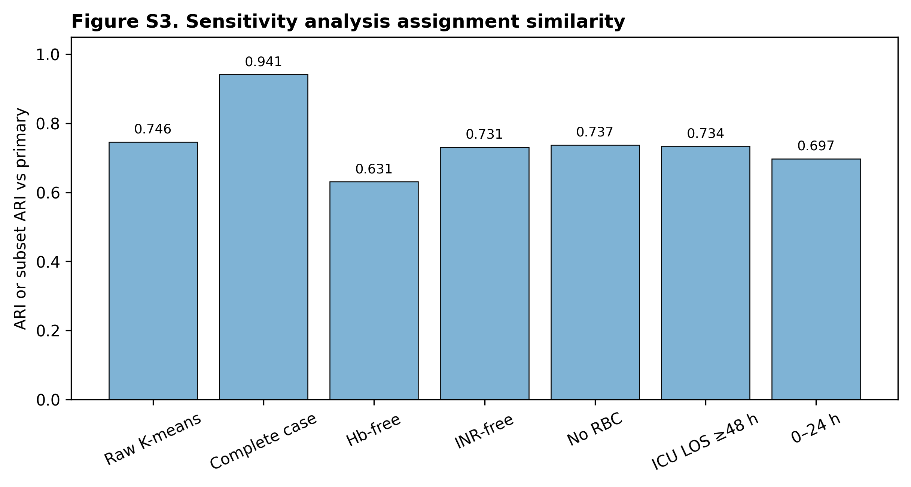
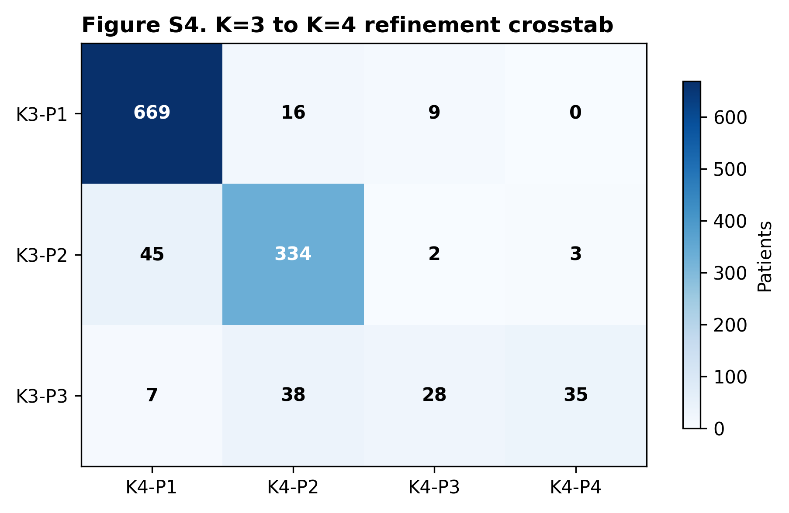
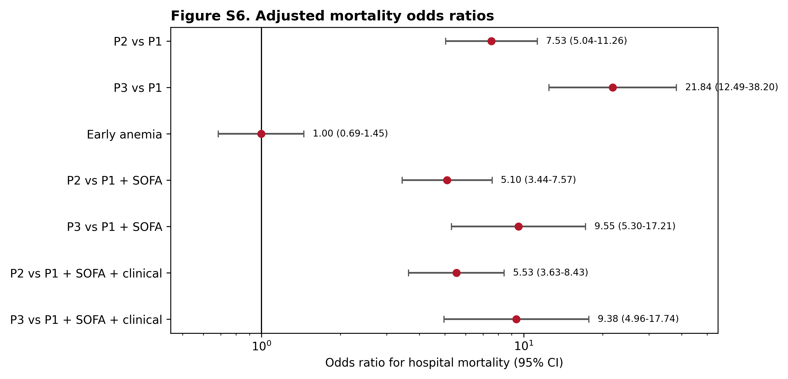
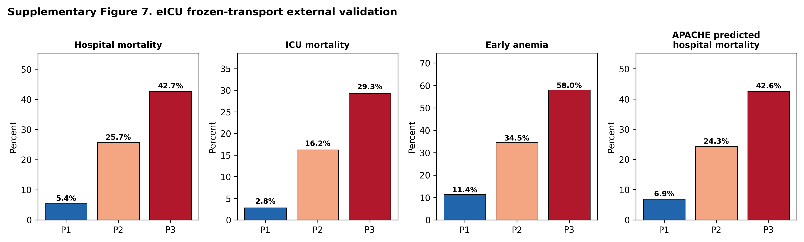

# Electronic Supplementary Material

## Early physiological phenotypes and outcomes in critically ill adults with non-traumatic subarachnoid hemorrhage

This Electronic Supplementary Material (ESM) accompanies the Intensive Care Medicine-style main manuscript. It provides cohort algorithms, code lists, variable mappings, extended tables, sensitivity analyses, supplementary figures, and reproducibility details.

## ESM 1. Cohort Algorithm and Provenance

### ESM Table 1. MIMIC-IV cohort-flow counts

| Step | Definition | Admissions | Patients |
| :--- | :--- | ---: | ---: |
| 01 | Source SAH admissions | 1,576 | 1,531 |
| 02 | Adult source SAH | 1,576 | 1,531 |
| 03 | Adult non-traumatic SAH; no aneurysm evidence required | 1,574 | 1,529 |
| 04 | First ICU stay among NSAH hospitalizations | 1,317 | 1,298 |
| 05 | ICU length of stay ≥24 h | 1,212 | 1,197 |
| 06 | Eight core features with ≤2 missing values | 1,186 | 1,173 |
| 07 | Primary analysis after excluding massive early transfusion | 1,186 | 1,173 |
| 08 | Sensitivity cohort: ICU length of stay ≥48 h | 1,005 | 996 |
| 09 | Sensitivity cohort: no recorded RBC transfusion in 0–48 h | 1,162 | 1,149 |

### ESM Table 2. eICU cohort-flow counts

| Step | Definition | Unit stays | Patients |
| :--- | :--- | ---: | ---: |
| 01 | SAH candidate unit stays from diagnosis/admissionDx | 2,880 | 2,571 |
| 02 | Adult patients | 2,863 | 2,554 |
| 03 | Exclude traumatic SAH flags | 1,314 | 1,158 |
| 04 | First ICU stay per unique patient | 1,153 | 1,153 |
| 05 | ICU length of stay ≥24 h | 903 | 903 |
| 06 | Eight core features with ≤2 missing values | 843 | 843 |
| 07 | Sensitivity cohort: ICU length of stay ≥48 h | 626 | 626 |
| 08 | Sensitivity cohort: no recorded RBC transfusion in 0–48 h | 819 | 819 |
| 09 | Strict SAH sensitivity definition | 605 | 605 |
| 10 | Low-missing sensitivity: ≤1 missing core feature | 819 | 819 |
| 11 | Complete-case sensitivity | 428 | 428 |

Counts in ESM Tables 1 and 2 are derived from `dist/20260708/figures/fig1_cohort_flowchart_data.json`, which was generated from BigQuery intermediate cohort-flow tables.

### ESM Table 3. Diagnostic code and text algorithm

| Data source | Inclusion evidence | Exclusion evidence |
| :--- | :--- | :--- |
| MIMIC-IV | ICD-9 `430` (subarachnoid hemorrhage); ICD-10 `I60.x` (nontraumatic subarachnoid hemorrhage subtypes) | ICD-10 `S06.6x` or diagnostic text consistent with traumatic subarachnoid hemorrhage |
| eICU-CRD | ICD-9 `430`; `apacheadmissiondx` containing "subarachnoid hemorrhage"; diagnosis table text consistent with subarachnoid hemorrhage | Diagnosis/admission text consistent with traumatic subarachnoid hemorrhage |

The algorithm intentionally did not require aneurysm diagnosis or aneurysm-securing procedure evidence for the primary NSAH cohort. A strict aneurysm subgroup was evaluated as sensitivity analysis.

## ESM 2. Variable Mapping and Preprocessing

### ESM Table 4. Core physiological feature definitions

| Domain | Feature | Definition | Window | Primary preprocessing |
| :--- | :--- | :--- | :--- | :--- |
| Neurological | `gcs_motor_min_48h` | Minimum GCS motor score | 0–48 h after ICU admission | Z-score standardization |
| Circulatory | `map_min_48h` | Minimum mean arterial pressure | 0–48 h after ICU admission | Z-score standardization |
| Circulatory | `shock_index_max_48h` | Maximum heart rate / systolic blood pressure | 0–48 h after ICU admission | Z-score standardization |
| Oxygenation | `spo2_min_48h` | Minimum pulse oximetry oxygen saturation | 0–48 h after ICU admission | Z-score standardization |
| Renal | `creatinine_max_48h` | Maximum serum creatinine | 0–48 h after ICU admission | log1p transformation, then Z-score |
| Coagulation | `inr_max_48h` | Maximum international normalized ratio | 0–48 h after ICU admission | log1p transformation, then Z-score |
| Hematologic | `hb_min_48h_all` | Minimum hemoglobin | 0–48 h after ICU admission | Z-score standardization |
| Hematologic | `platelet_min_48h` | Minimum platelet count | 0–48 h after ICU admission | Z-score standardization |

Missing values were imputed using MIMIC-IV derivation-cohort medians. External validation used frozen MIMIC-IV medians, scaler parameters, PCA loadings, and K-means centroids.

### ESM Table 5. Feature availability and data quality

| Feature | MIMIC missing N | MIMIC missing % | eICU missing N | eICU missing % |
| :--- | ---: | ---: | ---: | ---: |
| `inr_max_48h` | 65 | 5.48% | 446 | 49.4% |
| `creatinine_max_48h` | 1 | 0.08% | 31 | 3.4% |
| `platelet_min_48h` | 0 | 0.00% | 75 | 8.3% |
| `hb_min_48h_all` | 0 | 0.00% | 64 | 7.1% |
| `shock_index_max_48h` | 0 | 0.00% | 10 | 1.1% |
| `map_min_48h` | 0 | 0.00% | 10 | 1.1% |
| `spo2_min_48h` | 0 | 0.00% | 10 | 1.1% |
| `gcs_motor_min_48h` | 0 | 0.00% | 5 | 0.6% |

### ESM Table 6. Principal component loadings for the standardized feature space

| Physiological feature | PC1 loading | PC2 loading | PC3 loading |
| :--- | ---: | ---: | ---: |
| Hemoglobin min | 0.385 | -0.104 | -0.211 |
| GCS motor min | 0.412 | 0.289 | 0.150 |
| MAP min | 0.298 | 0.415 | -0.380 |
| Shock index max | -0.420 | -0.210 | 0.312 |
| SpO2 min | 0.198 | -0.580 | 0.412 |
| Creatinine max | -0.311 | 0.395 | 0.520 |
| INR max | -0.354 | 0.224 | 0.490 |
| Platelets min | 0.390 | -0.380 | -0.154 |

## ESM 3. Extended Tables

### ESM Table 7. Baseline characteristics of the MIMIC-IV derivation cohort

| Characteristic | Overall (N=1,186) | P1 (n=694) | P2 (n=384) | P3 (n=108) | p-value |
| :--- | :---: | :---: | :---: | :---: | :---: |
| **Demographics** | | | | | |
| Age, median [IQR], years | 61.0 [50.0–71.0] | 59.5 [49.0–70.0] | 62.0 [52.0–75.0] | 62.5 [48.0–70.0] | 0.026 |
| Female sex, n (%) | 665 (56.1%) | 393 (56.6%) | 234 (60.9%) | 38 (35.2%) | <0.001 |
| White race, n (%) | 696 (58.7%) | 449 (64.7%) | 191 (49.7%) | 56 (51.9%) | <0.001 |
| Black race, n (%) | 89 (7.5%) | 50 (7.2%) | 29 (7.6%) | 10 (9.3%) | |
| Other race, n (%) | 173 (14.6%) | 95 (13.7%) | 56 (14.6%) | 22 (20.4%) | |
| Unknown race, n (%) | 228 (19.2%) | 100 (14.4%) | 108 (28.1%) | 20 (18.5%) | |
| **Admission details** | | | | | |
| Emergency admission, n (%) | 830 (70.0%) | 469 (67.6%) | 307 (79.9%) | 54 (50.0%) | <0.001 |
| Observation admission, n (%) | 190 (16.0%) | 140 (20.2%) | 35 (9.1%) | 15 (13.9%) | |
| Urgent admission, n (%) | 121 (10.2%) | 66 (9.5%) | 26 (6.8%) | 29 (26.9%) | |
| Surgical same-day admission, n (%) | 32 (2.7%) | 15 (2.2%) | 12 (3.1%) | 5 (4.6%) | |
| Direct emergency / other, n (%) | 13 (1.1%) | 4 (0.6%) | 4 (1.0%) | 5 (4.6%) | |
| **Etiology and evidence** | | | | | |
| NSAH evidence level 1, n (%) | 423 (35.7%) | 252 (36.3%) | 99 (25.8%) | 72 (66.7%) | <0.001 |
| NSAH evidence level 2, n (%) | 529 (44.6%) | 305 (43.9%) | 190 (49.5%) | 34 (31.5%) | |
| NSAH evidence level 3, n (%) | 234 (19.7%) | 137 (19.7%) | 95 (24.7%) | 2 (1.9%) | |
| Aneurysm diagnosis, n (%) | 87 (7.3%) | 53 (7.6%) | 31 (8.1%) | 3 (2.8%) | 0.157 |
| Aneurysm-securing procedure, n (%) | 234 (19.7%) | 137 (19.7%) | 95 (24.7%) | 2 (1.9%) | <0.001 |
| **ICU interventions (0–48 h)** | | | | | |
| Nimodipine, n (%) | 675 (56.9%) | 432 (62.2%) | 226 (58.9%) | 17 (15.7%) | <0.001 |
| EVD or ICP monitoring, n (%) | 322 (27.2%) | 119 (17.1%) | 188 (49.0%) | 15 (13.9%) | <0.001 |
| Vasopressor use, n (%) | 252 (21.2%) | 43 (6.2%) | 154 (40.1%) | 55 (50.9%) | <0.001 |
| Mechanical ventilation, n (%) | 431 (36.3%) | 120 (17.3%) | 249 (64.8%) | 62 (57.4%) | <0.001 |
| Fluid balance, median [IQR], L | 1.38 [-0.45–2.96] | 0.94 [-0.65–2.26] | 2.26 [0.22–3.79] | 2.41 [-0.04–6.19] | <0.001 |
| CRRT, n (%) | 10 (0.8%) | 0 (0.0%) | 1 (0.3%) | 9 (8.3%) | <0.001 |
| **Outcomes** | | | | | |
| In-hospital mortality, n (%) | 235 (19.81%) | 44 (6.34%) | 125 (32.55%) | 66 (61.11%) | <0.001 |
| ICU mortality, n (%) | 182 (15.35%) | 25 (3.60%) | 102 (26.56%) | 55 (50.93%) | <0.001 |
| Early anemia (0–48 h), n (%) | 315 (26.56%) | 84 (12.10%) | 159 (41.41%) | 72 (66.67%) | <0.001 |
| RBC transfusion (0–48 h), n (%) | 24 (2.02%) | 3 (0.43%) | 13 (3.39%) | 8 (7.41%) | <0.001 |
| ICU LOS, median [IQR], days | 6.96 [2.88–13.41] | 6.38 [2.71–10.50] | 10.56 [3.83–17.50] | 5.38 [2.10–12.19] | <0.001 |
| Hospital LOS, median [IQR], days | 11.60 [6.42–19.91] | 9.94 [6.51–15.24] | 15.85 [6.70–24.79] | 13.31 [3.46–28.29] | <0.001 |

### ESM Table 8. Early physiological profiles of identified phenotypes

| Physiological variable (0–48 h) | Overall (N=1,186) | P1 (n=694) | P2 (n=384) | P3 (n=108) | p-value |
| :--- | :---: | :---: | :---: | :---: | :---: |
| Hemoglobin min, g/dL | 11.10 [9.80–12.40] | 11.70 [10.80–12.80] | 10.25 [9.10–11.50] | 8.85 [7.38–10.43] | <0.001 |
| GCS motor min | 5.00 [1.00–6.00] | 6.00 [5.00–6.00] | 1.00 [1.00–4.00] | 1.00 [1.00–5.00] | <0.001 |
| MAP min, mmHg | 61.00 [54.00–67.00] | 64.00 [58.00–70.00] | 58.00 [51.00–63.00] | 55.00 [47.50–61.00] | <0.001 |
| Shock index max | 0.88 [0.77–1.05] | 0.82 [0.73–0.92] | 1.00 [0.87–1.17] | 1.16 [0.93–1.42] | <0.001 |
| SpO2 min, % | 92.00 [90.00–94.00] | 92.00 [90.00–94.00] | 93.50 [92.00–96.00] | 88.50 [78.00–92.00] | <0.001 |
| Creatinine max, mg/dL | 0.80 [0.70–1.10] | 0.80 [0.60–0.90] | 0.90 [0.70–1.10] | 1.90 [1.18–3.20] | <0.001 |
| INR max | 1.20 [1.10–1.30] | 1.10 [1.10–1.20] | 1.20 [1.10–1.30] | 1.80 [1.40–2.30] | <0.001 |
| Platelets min, ×10³/µL | 188.0 [150.0–232.0] | 204.0 [169.25–245.0] | 174.0 [140.0–213.5] | 92.0 [40.75–160.25] | <0.001 |

### ESM Table 9. Multivariable logistic regression models for in-hospital mortality

| Variable | Model 1 aOR (95% CI) | Model 1 p-value | Model 2 aOR (95% CI) | Model 2 p-value |
| :--- | :---: | :---: | :---: | :---: |
| Phenotype 2 vs P1 | 7.59 (5.07–11.36) | <0.001 | 4.02 (2.60–6.24) | <0.001 |
| Phenotype 3 vs P1 | 21.21 (12.08–37.26) | <0.001 | 11.75 (6.52–21.20) | <0.001 |
| Early anemia | 0.99 (0.68–1.44) | 0.955 | 1.01 (0.69–1.50) | 0.941 |
| Age, per year | 1.03 (1.02–1.04) | <0.001 | 1.03 (1.02–1.04) | <0.001 |
| Male sex | 1.21 (0.86–1.70) | 0.274 | 1.15 (0.81–1.63) | 0.430 |
| Aneurysm diagnosis | 0.52 (0.24–1.14) | 0.101 | 0.55 (0.25–1.24) | 0.148 |
| NSAH evidence level 2 | 0.88 (0.60–1.29) | 0.499 | 0.91 (0.59–1.42) | 0.686 |
| NSAH evidence level 3 | 0.65 (0.38–1.09) | 0.102 | 0.78 (0.000–inf) | 1.000 |
| Emergency admission | 2.13 (0.75–6.06) | 0.156 | 2.53 (0.76–8.38) | 0.129 |
| Observation admission | 1.81 (0.59–5.54) | 0.298 | 2.21 (0.58–8.43) | 0.244 |
| Urgent admission | 3.38 (1.11–10.33) | 0.033 | 3.63 (0.95–13.95) | 0.060 |
| Nimodipine | — | — | 0.52 (0.46–0.58) | <0.001 |
| Vasopressor use | — | — | 2.63 (1.74–3.98) | <0.001 |
| Mechanical ventilation | — | — | 2.09 (1.40–3.11) | <0.001 |
| RBC transfusion | — | — | 0.39 (0.13–1.17) | 0.094 |
| CRRT | — | — | 0.80 (0.17–3.72) | 0.781 |
| EVD or ICP monitoring | — | — | 1.41 (1.00–1.99) | 0.052 |
| Fluid balance, L | — | — | 0.97 (0.92–1.02) | 0.233 |

Model 1 adjusted for baseline demographics, admission type, NSAH evidence level, aneurysm diagnosis, and early anemia. Model 2 additionally included process-of-care variables and is exploratory.

### ESM Table 10. Cox proportional hazards models for in-hospital survival

| Variable | Unadjusted HR (95% CI) | p-value | Clinical-adjusted HR (95% CI) | p-value | Process-adjusted HR (95% CI) | p-value |
| :--- | :---: | :---: | :---: | :---: | :---: | :---: |
| Phenotype 2 vs P1 | 4.20 (2.97–5.94) | <0.001 | 4.45 (3.11–6.37) | <0.001 | 3.08 (2.09–4.54) | <0.001 |
| Phenotype 3 vs P1 | 7.94 (5.38–11.70) | <0.001 | 8.62 (5.50–13.52) | <0.001 | 5.24 (3.25–8.47) | <0.001 |
| Early anemia | — | — | 0.76 (0.56–1.01) | 0.062 | 0.73 (0.54–0.99) | 0.044 |
| Age, per year | — | — | 1.02 (1.01–1.03) | <0.001 | 1.02 (1.01–1.03) | <0.001 |
| Male sex | — | — | 0.96 (0.74–1.26) | 0.788 | 0.88 (0.67–1.16) | 0.365 |
| Nimodipine | — | — | — | — | 0.59 (0.40–0.87) | 0.007 |
| Vasopressor use | — | — | — | — | 2.15 (1.57–2.94) | <0.001 |
| Mechanical ventilation | — | — | — | — | 1.79 (1.29–2.50) | <0.001 |

The process-adjusted Cox model includes 0–48 h interventions as fixed exploratory contextual covariates. It is vulnerable to treatment-selection and immortal time bias and should not be interpreted as estimating treatment effects.

### ESM Table 11. eICU external validation cohort characteristics and outcomes

| Characteristic | Overall (N=843) | P1 (n=539) | P2 (n=222) | P3 (n=82) |
| :--- | :---: | :---: | :---: | :---: |
| Age, median, years | 60.0 | 59.0 | 61.0 | 63.0 |
| Hemoglobin min, g/dL | 11.4 | 11.9 | 10.7 | 9.5 |
| GCS motor min | 6.0 | 6.0 | 4.0 | 4.0 |
| MAP min, mmHg | 58.0 | 62.0 | 51.0 | 51.5 |
| Shock index max | 0.97 | 0.88 | 1.14 | 1.26 |
| SpO2 min, % | 90.0 | 90.0 | 92.0 | 74.5 |
| Creatinine max, mg/dL | 0.81 | 0.75 | 0.81 | 1.54 |
| INR max | 1.1 | 1.1 | 1.1 | 1.5 |
| Platelets min, ×10³/µL | 200.0 | 207.0 | 202.5 | 146.0 |
| APACHE score, median | 43.0 | 36.0 | 57.0 | 79.0 |
| APS score, median | 33.0 | 27.0 | 49.0 | 67.0 |
| Predicted hospital mortality, median | 0.112 | 0.069 | 0.243 | 0.426 |
| Early anemia (0–48 h), n (%) | 183 (21.7%) | 60 (11.4%) | 76 (34.5%) | 47 (58.0%) |
| RBC transfusion (0–48 h), n (%) | 24 (2.8%) | 2 (0.4%) | 13 (5.9%) | 9 (11.0%) |
| Hospital mortality, n (%) | 121 (14.35%) | 29 (5.38%) | 57 (25.68%) | 35 (42.68%) |
| ICU mortality, n (%) | 65 (7.71%) | 15 (2.78%) | 36 (16.22%) | 24 (29.27%) |

### ESM Table 12. Sensitivity analysis summary

| Analysis | N | P1 mortality | P2 mortality | P3/P4 mortality | Minimum subgroup N |
| :--- | ---: | :---: | :---: | :---: | ---: |
| MIMIC primary log-PCA | 1,186 | 6.34% | 32.55% | 61.11% (P3) | 108 |
| eICU frozen transport | 843 | 5.38% | 25.68% | 42.68% (P3) | 82 |
| MIMIC complete case | 1,120 | 6.53% | 38.58% | 65.07% (P3) | 63 |
| MIMIC strict aneurysm | 763 | 5.73% | 30.82% | 50.00% (P3) | 48 |
| MIMIC ICU LOS ≥48 h | 1,005 | 6.07% | 34.38% | 58.70% (P3) | 46 |
| MIMIC no RBC 0–48 h | 1,162 | 6.58% | 37.47% | 68.85% (P3) | 61 |
| MIMIC Hb-free clustering | 1,186 | 6.85% | 39.52% | 64.10% (P3) | 78 |
| MIMIC INR-free clustering | 1,186 | 6.00% | 35.32% | 66.67% (P3) | 84 |
| MIMIC K=4 resolution | 1,186 | 6.17% (P1) | 37.99% (P2) | 61.54% (P3) / 56.41% (P4) | 39 |
| eICU ICU LOS ≥48 h | 626 | 6.9% | 24.2% | 33.9% (P3) | 62 |
| eICU no RBC 0–48 h | 819 | 5.4% | 25.8% | 39.7% (P3) | 73 |
| eICU strict SAH | 605 | 6.6% | 30.5% | 45.6% (P3) | 68 |
| eICU INR-free transport | 868 | 4.6% | 24.4% | 38.7% (P3) | 124 |

### ESM Table 13. Bootstrap stability analysis

| Metric | Mean | Standard deviation | Minimum | Maximum |
| :--- | ---: | ---: | ---: | ---: |
| Adjusted Rand Index (ARI) | 0.9199 | 0.0479 | 0.7454 | 0.9927 |
| Same ordered label rate | 96.96% | 1.97% | 89.21% | 99.75% |
| Minimum cluster size, N | 108.7 | 16.8 | 48.0 | 140.0 |

## ESM 4. Supplementary Figures

**ESM Fig. 1.** Cluster-quality metrics across K=2 to K=5 for raw standardized and primary log-PCA pipelines.

**ESM Fig. 2.** Adjusted Rand Index distribution across 200 bootstrap iterations compared with the primary K-means K=3 partition.

**ESM Fig. 3.** Standardized cluster centers for sensitivity partitions, demonstrating alignment with the primary log-PCA centroids.

**ESM Fig. 4.** High-resolution K=4 refinement crosstab, illustrating how the primary P3 phenotype splits into two smaller high-risk subcohorts.

**ESM Fig. 5.** Loadings of the eight physiological variables on the first three principal components.

**ESM Fig. 6.** Forest plot showing multivariable logistic regression and Cox proportional hazards odds/hazard ratios with 95% confidence intervals for primary and sensitivity models.

**ESM Fig. 7.** eICU validation performance, including transported phenotype calibration, calibration slope, and de novo clustering comparison metrics.

## ESM 5. Reproducibility Notes

### Analysis scripts

| Step | Script or artifact | Purpose |
| :--- | :--- | :--- |
| Cohort SQL execution | `scripts/12_run_non_traumatic_sah_cohort_sql.py` | Runs `10_create_non_traumatic_sah_cohort.sql` in BigQuery |
| Phenotype analysis | `scripts/13_run_non_traumatic_sah_analysis.py` | Executes `11_bigquery_notebook_non_traumatic_sah_analysis.py` locally |
| Figure generation | `scripts/generate_manuscript_figures.py` | Regenerates all main and supplementary figures |
| PDF rendering | `scripts/convert_manuscript_to_pdf.py` | Converts manuscript and ESM markdown files to PDF |
| Cohort-flow counts | `dist/20260708/figures/fig1_cohort_flowchart_data.json` | Stores BigQuery-derived MIMIC and eICU flow counts |

### Key reproducibility parameters

| Component | Value |
| :--- | :--- |
| Primary physiology window | 0–48 h after ICU admission |
| Primary feature count | 8 variables |
| Missing-data rule | ≤2 missing core features |
| Imputation | MIMIC-IV derivation-cohort median; frozen for eICU |
| Skewed-feature transform | log1p for creatinine and INR |
| Standardization | MIMIC-IV derivation-cohort mean and standard deviation |
| PCA components retained | 3 |
| Variance explained | 56.41% |
| K-means K | 3 |
| K-means random state | 42 |
| K-means n_init | 100 |
| Bootstrap iterations | 200 |
| External validation | Frozen MIMIC medians, scaler, PCA loadings, and centroids applied to eICU |

### BigQuery provenance

The project-level BigQuery dataset for the current non-traumatic SAH study is `mimic-study-498508.non_traumatic_sah_study`. MIMIC-IV source tables were drawn from PhysioNet MIMIC-IV 3.1 datasets. eICU validation used the eICU-CRD source tables available through PhysioNet. The exact final table names should be verified after the final BigQuery rerun and recorded in the repository release notes before journal submission.
