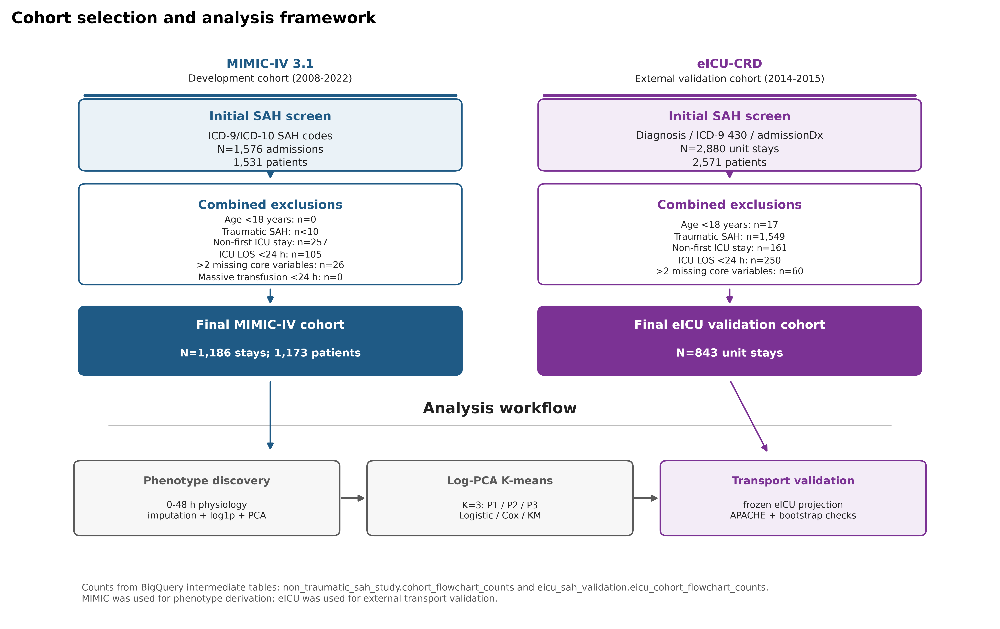
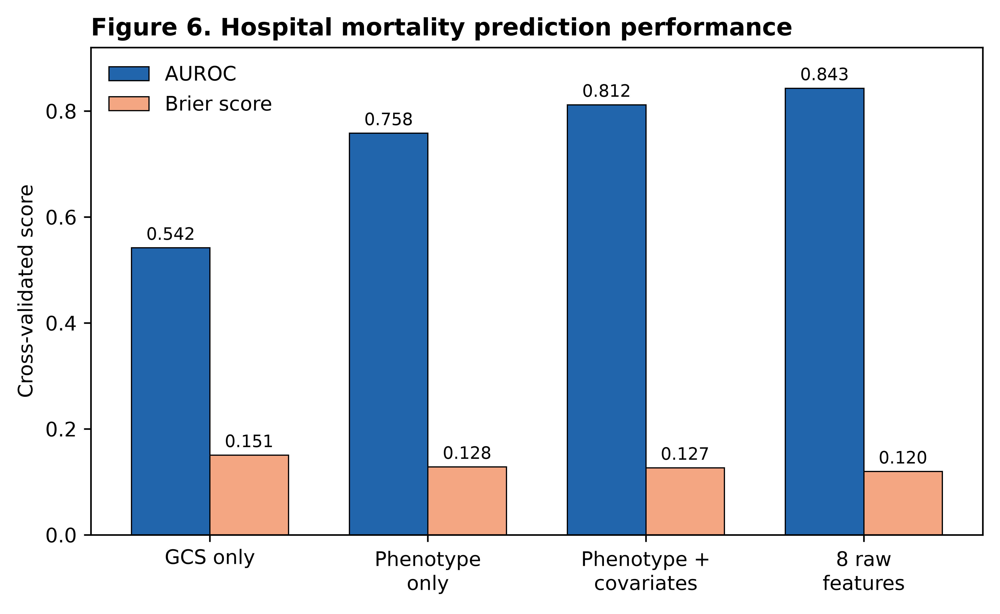

# Early physiological phenotypes and outcomes in critically ill adults with non-traumatic subarachnoid hemorrhage

## Take-home message

In critically ill adults with non-traumatic subarachnoid hemorrhage, eight routine physiological variables measured during the first 48 hours separated patients into three neuro-systemic phenotypes with different mortality risks. A classifier trained in MIMIC-IV kept the same risk ordering when applied to eICU. Early anemia was more common in high-risk phenotypes, but it was not associated with mortality after adjustment for phenotype.

## Structured abstract

### Purpose

Risk stratification in non-traumatic subarachnoid hemorrhage (NSAH) may benefit from considering both neurological and systemic physiology. We aimed to identify early physiological phenotypes in critically ill adults with NSAH, test whether they transported to an external ICU database, and examine their relation to mortality and early anemia.

### Methods

We performed a retrospective cohort study using MIMIC-IV 3.1 for derivation and the eICU Collaborative Research Database for external validation. Adult ICU patients with NSAH and an ICU stay >=24 h were included. Eight variables from the first 48 h covered neurological, circulatory, oxygenation, renal, hematologic, and coagulation domains. We log1p transformed skewed variables, standardized all variables, reduced them with principal component analysis, and clustered patients with K-means. External validation used fixed MIMIC preprocessing parameters, principal components, and centroids.

### Results

The derivation cohort included 1,186 patients. The three phenotypes were P1, mild neuro-systemic impairment (n=694); P2, severe neurological impairment with limited systemic dysfunction (n=384); and P3, severe neurological impairment with multisystem shock or organ dysfunction (n=108). In-hospital mortality was 6.34% in P1, 32.55% in P2, and 61.11% in P3. Compared with P1, adjusted odds ratios for death were 7.59 (95% CI 5.07-11.36) for P2 and 21.21 (95% CI 12.08-37.26) for P3. Early anemia was more frequent in severe phenotypes, but it was not independently associated with mortality after phenotype adjustment. In eICU (N=843), transported phenotypes kept the same mortality ordering (5.4%, 25.7%, 42.7%).

### Conclusions

Routine physiology from the first 48 h of ICU care identified NSAH phenotypes that transported to an external database and stratified mortality risk. These phenotypes may help define risk groups for future studies, but this analysis does not estimate treatment effects.

**Keywords:** subarachnoid hemorrhage; critical care; phenotyping; unsupervised learning; external validation.

## Introduction

Non-traumatic subarachnoid hemorrhage (NSAH) is a high-acuity neurological emergency with substantial mortality and long-term disability [@macdonald2017sah]. Clinical grading includes Hunt-Hess, WFNS, and the Glasgow Coma Scale (GCS) [@hunt1968surgicalrisk; @teasdale1988wfns; @teasdale1974gcs]. These tools remain clinically useful; this study was motivated by the possibility that adding systemic physiology could reveal structure not represented by neurological grading alone.

In aneurysmal SAH, systemic inflammation may contribute to intracranial and extracranial injury [@chai2023inflammation]. Anemia has also been described after aneurysmal SAH [@rosenberg2013anemia]. These observations motivated our neuro-systemic perspective; the present study extended it to routinely measured renal, hematologic, and coagulation physiology in NSAH. General ICU scores such as APACHE and SOFA summarize general illness severity and organ dysfunction, respectively, rather than NSAH-specific neuro-systemic patterns [@knaus1985apacheii; @vincent1996sofa].

Unsupervised phenotyping offers a way to study subgroups within heterogeneous critical illness syndromes, with clinically distinct subgroups reported in sepsis and acute respiratory distress syndrome [@seymour2019sepsisphenotypes; @calfee2014ardssubphenotypes]. These applications motivated our evaluation of early multimodal physiology in neurocritical care. We hypothesized that early multimodal physiology would separate critically ill NSAH patients into phenotypes with ordered mortality risk; that early anemia would add limited prognostic information after accounting for phenotype; and that a MIMIC-derived classifier would retain risk ordering when applied to an external ICU database.

## Methods

### Study design and data sources

We performed a retrospective cohort study using two de-identified public ICU databases: MIMIC-IV version 3.1 [@johnson2023mimiciv; @johnson2024mimiciv31] and eICU-CRD version 2.0 [@pollard2018eicu; @pollard2019eicu20]. MIMIC-IV was the derivation cohort, and eICU-CRD was the external validation cohort. Database access was obtained after completion of Collaborative Institutional Training Initiative training and data-use requirements. Both source records describe de-identified resources with credentialed access and data-use requirements [@johnson2024mimiciv31; @pollard2019eicu20]. The final consent-waiver language remains to be confirmed against source database governance and local ethics requirements. The study follows STROBE guidance [@vonelm2007strobe]; the checklist is intended for Electronic Supplementary Material.

### Cohort

Adults admitted to an ICU with NSAH were eligible if ICU length of stay was at least 24 h and no more than two of eight core physiological variables were missing. MIMIC patients were identified using ICD-9 code 430 or ICD-10 I60.x codes. eICU patients were identified using ICD-9 code 430, admission diagnosis text containing subarachnoid hemorrhage, or diagnosis table entries consistent with NSAH. Patients with traumatic subarachnoid hemorrhage, multiple ICU stays during the index hospitalization, or red blood cell transfusion within 24 h meeting the study-specific operational exclusion (>=5 units) were excluded. This study-specific restriction was intended to limit distortion of baseline hemoglobin, hemodynamic, and coagulation signals; it was not treated as an externally validated massive-transfusion threshold.

### Variables and preprocessing

The analysis used eight variables from the first 48 h after ICU admission: minimum GCS motor score, minimum mean arterial pressure, maximum shock index, minimum oxygen saturation, maximum creatinine, maximum international normalized ratio, minimum hemoglobin, and minimum platelet count. Values outside clinically plausible ranges were removed. Missing values were imputed with derivation-cohort medians. Creatinine and international normalized ratio were log1p transformed because their distributions were right skewed. All variables were standardized with derivation-cohort means and standard deviations.

### Phenotype derivation and validation

Principal component analysis was applied to the standardized eight-variable matrix. Three components were retained and explained 56.41% of the variance. K-means clustering was performed in the three-component space using `random_state = 42` and `n_init = 100`. K=3 was selected from cluster metrics, minimum cluster size, bootstrap stability, and clinical interpretability. Phenotypes were ordered by increasing mortality.

External validation used fixed transport. eICU data were imputed, transformed, and standardized with MIMIC parameters, projected with MIMIC principal component loadings, and assigned to the nearest MIMIC phenotype centroid. Transported phenotypes were evaluated against mortality and eICU-provided severity variables that were not used for phenotype assignment. De novo eICU clustering was used only as a structural sensitivity analysis.

### Outcomes and statistical analysis

The primary outcome was in-hospital mortality. Secondary outcomes included ICU mortality, length of stay, early anemia, and red blood cell transfusion. Multivariable logistic regression assessed the association between phenotype and hospital mortality. The primary model adjusted for age, sex, admission type, NSAH evidence level, aneurysm diagnosis, and early anemia. A process-of-care model also included nimodipine, vasopressors, mechanical ventilation, red blood cell transfusion, renal replacement therapy, EVD/ICP monitoring, and fluid balance. We interpreted process variables as exploratory severity and treatment-selection markers, not causal treatment effects. Cox models were used as sensitivity analyses for time to in-hospital death. Sensitivity analyses included complete-case, strict aneurysm, ICU stay >=48 h, 0-24 h window, hemoglobin-free, INR-free, K=4, and 200-bootstrap stability analyses.

## Results

### Cohort and phenotype structure

The MIMIC derivation cohort included 1,186 adults. Overall in-hospital mortality was 19.81%, early anemia occurred in 26.56%, and red blood cell transfusion within 48 h occurred in 2.02%. Missingness was low in the derivation cohort: maximum INR was missing in 5.48%, and all other core features were missing in <=0.08%.

The K=3 solution identified three clinically interpretable phenotypes (Fig. 1 and Fig. 2). P1 included 694 patients (58.5%) and had mild neurological and systemic impairment. P2 included 384 patients (32.4%) and had severe neurological impairment with relatively preserved systemic physiology. P3 included 108 patients (9.1%) and combined severe neurological impairment with hypotension, elevated shock index, hypoxemia, renal dysfunction, coagulopathy, thrombocytopenia, and lower hemoglobin.

**Fig. 1.** Cohort selection and analysis design. Counts were derived from BigQuery intermediate cohort-flow tables. The lower panel summarizes MIMIC phenotype derivation and eICU fixed transport.

**Fig. 2.** Early physiological profiles of the three MIMIC-derived phenotypes. Values represent standardized cluster centers with raw medians and interquartile ranges.

### Outcomes and anemia

Mortality increased across phenotypes (Fig. 3). In-hospital mortality was 6.34% in P1, 32.55% in P2, and 61.11% in P3. ICU mortality followed the same order: 3.60%, 26.56%, and 50.93%, respectively. In unadjusted Cox analysis, hazard ratios for hospital death were 4.20 (95% CI 2.97-5.94) for P2 and 7.94 (95% CI 5.38-11.70) for P3 compared with P1.

**Fig. 3.** Outcome, anemia, and early red blood cell transfusion patterns in MIMIC-IV. Red blood cell transfusion is shown as a descriptive process variable and should not be interpreted as a treatment-effect estimate.

In the primary logistic model, P2 and P3 remained associated with in-hospital mortality after adjustment. Compared with P1, adjusted odds ratios were 7.59 (95% CI 5.07-11.36) for P2 and 21.21 (95% CI 12.08-37.26) for P3. Early anemia was more frequent in P2 and P3 but was not independently associated with mortality after phenotype adjustment (adjusted odds ratio 0.99, 95% CI 0.68-1.44). The process-of-care model attenuated phenotype associations but did not remove them. These process-adjusted estimates are exploratory because several variables occurred during the feature window.

### External validation

The eICU validation cohort included 843 patients. Fixed transport assigned 539 patients to P1, 222 to P2, and 82 to P3. Hospital mortality increased from 5.4% in P1 to 25.7% in P2 and 42.7% in P3. ICU mortality, early anemia, and red blood cell transfusion also increased across transported phenotypes.

Transported phenotype order aligned with eICU-provided severity variables that were not used for assignment (Fig. 4). Median APACHE scores were 36, 57, and 79 across P1, P2, and P3, with Spearman rho 0.480. Acute Physiology Score and predicted hospital mortality showed similar ordering. These variables were not used for phenotype assignment.

**Fig. 4.** Comparison with eICU-provided severity variables. APACHE, Acute Physiology Score, and predicted mortality were not clustering inputs.

Independent de novo K-means clustering in eICU recovered ordered mortality differences, but patient-level agreement with transported labels was low (adjusted Rand index -0.003). This result supports transportability of the risk ordering, not exact replication of cluster boundaries across databases.

### Prediction and robustness

A multivariable eight-variable physiological model improved mortality prediction compared with GCS alone (Fig. 5). Cross-validated AUROC was 0.842 for the full physiological model, 0.754 for phenotype only, and 0.539 for GCS only. SHAP-style attribution ranked GCS motor, creatinine, and platelets as the most influential variables, consistent with neurological, renal, and coagulation axes.

**Fig. 5.** Incremental prediction of in-hospital mortality in MIMIC-IV.

Sensitivity analyses preserved the ordered mortality pattern. Bootstrap stability was high, with mean adjusted Rand index 0.920 across 200 resamples. Hemoglobin-free clustering preserved phenotype-mortality separation and supported the conclusion that the anemia result was not driven only by the inclusion of hemoglobin in the primary clustering model.

## Discussion

This study identified three early NSAH phenotypes using routine ICU physiology and validated their risk ordering in an external multicenter database. The phenotypes separated patients with mild neuro-systemic impairment, severe neurological impairment with limited systemic dysfunction, and severe neurological impairment with multisystem organ dysfunction. The distinction between P2 and P3 is clinically relevant: both had severe neurological impairment, but P3 also had broad systemic derangement and much higher mortality.

These results complement existing scales rather than replacing them. Hunt-Hess, WFNS, and GCS emphasize neurological status [@hunt1968surgicalrisk; @teasdale1988wfns; @teasdale1974gcs]. APACHE and SOFA summarize general critical illness severity and organ dysfunction [@knaus1985apacheii; @vincent1996sofa]. The phenotypes described here sit between those approaches: they retain neurological interpretability while also capturing systemic physiology in this NSAH cohort. In this study, the framework provided risk stratification; its value for cohort enrichment or trial stratification requires prospective evaluation.

The anemia results require cautious interpretation. Early anemia was common in high-risk phenotypes but was not independently associated with mortality after phenotype adjustment. This study-specific pattern suggests that anemia may mark global physiological derangement rather than act as an isolated prognostic driver. The observation is consistent with recent randomized evidence in aneurysmal subarachnoid hemorrhage showing no clear statistically significant long-term neurological benefit from a liberal transfusion strategy [@english2025sahara]. However, our study does not estimate transfusion effects and should not guide transfusion thresholds. Phenotype-stratified causal analyses or randomized trials would be needed for that question.

External validation showed the same mortality and severity ordering in eICU. At the same time, de novo eICU clustering did not reproduce patient-level labels. This tension matters. The observed discordance may reflect database-specific measurement, missingness, or documentation patterns, but this study did not test those mechanisms directly. Our findings support prospective evaluation of the fixed classifier; they do not establish that fixed transport is more useful than repeated de novo clustering.

The main strength of this study is the use of a simple, reproducible pipeline based on routine variables available early in ICU care, with external validation and multiple sensitivity analyses. The approach is deliberately conservative: it avoids high-dimensional black-box modeling for phenotype derivation and focuses on interpretable neuro-systemic patterns.

Several limitations should be acknowledged. First, as a retrospective analysis of MIMIC-IV and eICU, this study cannot eliminate residual confounding or misclassification. Second, detailed neuroimaging variables, including Fisher grade, hemorrhage volume, aneurysm location, hydrocephalus, and procedure timing, were unavailable. Third, the 0-48 h window may include physiology modified by early ICU interventions. Fourth, eICU INR missingness was substantial, although INR-free sensitivity analyses preserved risk ordering. Finally, the source records describe MIMIC-IV as a US single-center resource and eICU as a US multicenter resource [@johnson2023mimiciv; @pollard2018eicu]. Prospective validation in contemporary and geographically diverse neurocritical care cohorts is therefore required.

## Conclusions

Eight routine physiological variables measured during the first 48 h of ICU admission identified three NSAH phenotypes with ordered mortality risk. The MIMIC-derived classifier kept this ordering in eICU and aligned with eICU-provided severity variables that were not used for phenotype assignment. Early anemia appeared to mark severe systemic derangement rather than independently predict mortality after phenotype adjustment. These phenotypes may help define risk strata for future studies, pending prospective validation.

## Declarations

**Funding:** To be completed by authors before submission.

**Conflicts of interest:** To be completed by authors before submission.

**Ethics approval:** MIMIC-IV and eICU-CRD are publicly available de-identified research databases [@johnson2024mimiciv31; @pollard2019eicu20]. Database access was obtained after required training and data-use agreements. Local ethics documentation should be completed according to the submitting institution and target journal requirements.

**Consent to participate:** To be confirmed against source database governance and local ethics requirements before submission.

**Data availability:** MIMIC-IV and eICU-CRD are available through PhysioNet to credentialed users who complete required training and data-use agreements [@johnson2024mimiciv31; @pollard2019eicu20]. Derived aggregate outputs are included in the manuscript and Electronic Supplementary Material.

**Code availability:** Analysis code and reproducible preprocessing parameters should be provided in a public repository or submitted as supplementary material before journal submission.

**Author contributions:** To be completed by authors before submission.

**Use of AI-assisted tools:** AI-assisted drafting and editing tools were used to help prepare manuscript text and formatting. All scientific content, analyses, data interpretation, and final wording require author verification before submission.

**Reporting guideline:** The STROBE checklist [@vonelm2007strobe] will be submitted as Electronic Supplementary Material.

## Electronic supplementary material

The Electronic Supplementary Material is prepared as `electronic_supplementary_material.md` and includes the cohort algorithm, ICD/code-list, variable mapping, missingness audit, extended baseline/phenotype/regression/Cox/eICU/sensitivity tables, supplementary figures, BigQuery provenance, and reproducibility parameters. The STROBE checklist is prepared separately as `strobe_checklist.md`.
