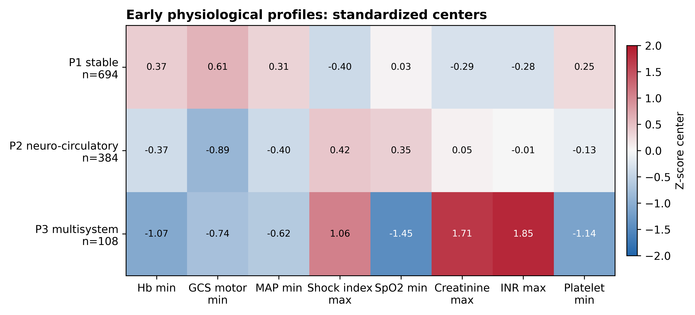

# Early physiological phenotypes and outcomes in critically ill adults with non-traumatic subarachnoid hemorrhage

## Take-home message

In critically ill adults with non-traumatic subarachnoid hemorrhage, eight routine physiological variables measured during the first 48 hours separated patients into three neuro-systemic phenotypes with different observed in-hospital mortality. A classifier trained in MIMIC-IV preserved this mortality ordering when applied to eICU. Early anemia was more common in phenotypes with greater systemic derangement, but it was not associated with mortality after phenotype adjustment.

## Structured abstract

### Purpose

Patients with non-traumatic subarachnoid hemorrhage (NSAH) demonstrate substantial heterogeneity in clinical trajectory and outcome, even among those with similar neurological severity. Conventional neurological assessment may not fully capture early systemic physiological responses. We aimed to identify early physiological phenotypes among critically ill adults with NSAH, evaluate their associations with mortality and early anemia, and assess fixed phenotype transport in an independent ICU cohort.

### Methods

We conducted a retrospective two-database cohort study of adults with NSAH and an ICU stay >=24 h, using MIMIC-IV 3.1 (2008-2022) for phenotype derivation and eICU-CRD 2.0 (2014-2015) for external validation. Eight routinely available variables measured during the first 48 h represented neurological, circulatory, respiratory, renal, hematologic, and coagulation domains. After median imputation, skewed variables were transformed using log1p (natural logarithm of 1 + x), and all variables were standardized. Principal component analysis was used for dimensionality reduction, followed by K-means clustering in the retained component space. The number of clusters was selected using internal validity metrics, cluster stability, minimum cluster size, and clinical interpretability. Associations between phenotype assignment and in-hospital mortality were evaluated using multivariable logistic regression. External validation in eICU used fixed MIMIC preprocessing parameters, loadings, and centroids.

### Results

Among 1,186 MIMIC patients, P1 had relatively preserved neuro-systemic physiology (n=694), P2 had severe neurological impairment with limited systemic dysfunction (n=384), and P3 had severe neurological impairment with multisystem dysfunction (n=108). Observed in-hospital mortality increased across P1, P2, and P3 (6.34%, 32.55%, and 61.11%, respectively; p < 0.001). Compared with P1, adjusted odds ratios for death were 7.59 (95% CI 5.07-11.36) for P2 and 21.21 (95% CI 12.08-37.26) for P3. Early anemia was more frequent in P2 and P3 but was not associated with mortality after phenotype adjustment (adjusted odds ratio 0.99, 95% CI 0.68-1.44). In eICU (N=843), fixed transport retained the mortality ordering (5.4%, 25.7%, and 42.7%).

### Conclusions

Early physiological measurements available during routine ICU care identified three clinically interpretable NSAH phenotypes with graded observed mortality and preserved ordering after transport to an independent database. Multidomain physiological assessment may complement conventional neurological evaluation by characterizing systemic heterogeneity, but prospective studies are required before clinical use; this descriptive analysis does not estimate treatment effects.

**Keywords:** subarachnoid hemorrhage; critical care; phenotyping; unsupervised learning; external validation.

## Introduction

Non-traumatic subarachnoid hemorrhage (NSAH) is a high-acuity neurological emergency with substantial mortality and long-term disability [@macdonald2017sah]. Clinical grading includes Hunt-Hess, WFNS, and the Glasgow Coma Scale (GCS) [@hunt1968surgicalrisk; @teasdale1988wfns; @teasdale1974gcs]. These scales capture neurological severity but do not incorporate the range of systemic measurements routinely collected in the ICU.

Studies of aneurysmal SAH describe systemic inflammation that may contribute to intracranial and extracranial injury [@chai2023inflammation] and frequent anemia during acute care [@rosenberg2013anemia]. We therefore examined neurological measurements together with renal, hematologic, circulatory, respiratory, and coagulation variables in NSAH. APACHE and SOFA summarize general illness severity and organ dysfunction, respectively, but were not developed to identify NSAH-specific physiological patterns [@knaus1985apacheii; @vincent1996sofa].

Unsupervised analyses have identified clinically distinct subgroups in sepsis and acute respiratory distress syndrome [@seymour2019sepsisphenotypes; @calfee2014ardssubphenotypes]. We applied this approach to early multimodal physiology in neurocritical care. We hypothesized that the resulting NSAH phenotypes would differ in observed mortality, that early anemia would add limited information after phenotype adjustment, and that a classifier derived in MIMIC-IV would preserve the mortality ordering in an external ICU database.

## Methods

### Study design and data sources

We performed a retrospective cohort study using two de-identified, credentialed-access ICU databases: MIMIC-IV version 3.1, covering admissions during 2008-2022 [@johnson2023mimiciv; @johnson2024mimiciv31], and eICU-CRD version 2.0, covering 2014-2015 [@pollard2018eicu; @pollard2019eicu20]. Both resources are distributed through PhysioNet [@goldberger2000physionet]. MIMIC-IV was the derivation cohort, and eICU-CRD was the external validation cohort. Database access was obtained after completion of Collaborative Institutional Training Initiative training and data-use requirements. Both source records describe de-identified resources with credentialed access and data-use requirements [@johnson2024mimiciv31; @pollard2019eicu20]. The final consent-waiver language remains to be confirmed against source database governance and local ethics requirements. Reporting was prepared against STROBE and RECORD guidance [@vonelm2007strobe; @benchimol2015record]; checklist mappings are provided separately.

### Cohort

Adults admitted to an ICU with NSAH were eligible if ICU length of stay was at least 24 h and no more than two of eight core physiological variables were missing. MIMIC patients were identified using ICD-9 code 430 or ICD-10 I60.x codes. eICU patients were identified using ICD-9 code 430, admission diagnosis text containing subarachnoid hemorrhage, or diagnosis table entries consistent with NSAH. The cross-database NSAH identification algorithm was not formally validated against manual chart review. Patients with traumatic subarachnoid hemorrhage, multiple ICU stays during the index hospitalization, or red blood cell transfusion within 24 h meeting the study-specific operational exclusion (>=5 units) were excluded. This study-specific restriction was intended to limit distortion of baseline hemoglobin, hemodynamic, and coagulation signals; it was not treated as an externally validated massive-transfusion threshold.

### Variables and preprocessing

Eight routinely available variables were selected a priori to represent early neurological and systemic physiology: minimum GCS motor score, minimum mean arterial pressure, maximum shock index, minimum oxygen saturation, maximum creatinine, maximum international normalized ratio, minimum hemoglobin, and minimum platelet count. Variable selection was performed before outcome analyses and was based on clinical relevance and availability during early ICU care rather than associations with mortality. Measurements were summarized during the first 48 h after ICU admission to characterize early physiology, while recognizing that treatment-related changes could occur within this window. Values outside clinically plausible ranges were removed. Missing values were imputed with derivation-cohort medians. Creatinine and international normalized ratio were log1p transformed because their distributions were right skewed. All variables were standardized with derivation-cohort means and standard deviations.

### Phenotype derivation and validation

Principal component analysis was used as a dimensionality-reduction step before clustering rather than as a clustering method itself. It reduced correlation and redundancy among physiological variables and generated orthogonal components representing major patterns of early neuro-systemic variation. K-means clustering was subsequently performed in this reduced feature space to identify patient groups with similar physiological profiles. Three principal components were retained for clustering based on explained variance and representation of the major physiological patterns. K-means clustering was performed in the three-component space using `random_state = 42` and `n_init = 100. Candidate solutions ranging from K=2 to K=6 were evaluated using internal clustering indices, including silhouette coefficient, Calinski–Harabasz index, and Davies–Bouldin index, together with minimum cluster size, bootstrap stability, and clinical interpretability. Outcome variables were not considered during cluster number selection. The three-cluster solution was selected because it provided the best balance between statistical performance, stability, and clinical interpretability. After clustering, phenotype labels were assigned post hoc for presentation using a direction-weighted physiological severity score calculated from standardized cluster centers. Original physiological variables were then used to characterize and interpret the resulting phenotypes. Mortality was used neither for clustering nor for label ordering.

External validation used fixed transport. eICU data were imputed, transformed, and standardized with MIMIC parameters, projected with MIMIC principal component loadings, and assigned to the nearest MIMIC phenotype centroid. Because unsupervised clusters are data-dependent, external validation focused on preservation of clinically relevant mortality and severity ordering rather than exact replication of patient-level cluster membership. Transported phenotypes were evaluated against mortality and eICU-provided severity variables that were not used for phenotype assignment. De novo eICU clustering was used only as a structural sensitivity analysis.

### Outcomes and statistical analysis

The primary outcome was in-hospital mortality. Secondary outcomes included ICU mortality, length of stay, early anemia, and red blood cell transfusion. Continuous variables were summarized using appropriate measures of central tendency and dispersion, and categorical variables as frequencies and percentages. Because a death could occur during the 0-48 h feature window, mortality analyses describe same-hospital associations rather than prognosis from a 48 h landmark. Multivariable logistic regression assessed the association between phenotype and hospital mortality. The primary model adjusted for age, sex, admission type, NSAH evidence level, aneurysm diagnosis, and early anemia. A process-of-care model also included nimodipine, vasopressors, mechanical ventilation, red blood cell transfusion, renal replacement therapy, EVD/ICP monitoring, and fluid balance. We interpreted process variables as exploratory severity and treatment-selection markers, not causal treatment effects. Cox models were used as sensitivity analyses for time to in-hospital death. Statistical tests were two-sided with p < 0.05 considered statistically significant. Sensitivity analyses included complete-case, strict aneurysm, ICU stay >=48 h, 0-24 h window, hemoglobin-free, INR-free, K=4, and 200-bootstrap stability analyses.

## Results

### Cohort and phenotype structure

The MIMIC derivation cohort included 1,186 adults and demonstrated substantial heterogeneity in neurological severity and systemic physiology. Overall in-hospital mortality was 19.81%, early anemia occurred in 26.56%, and red blood cell transfusion within 48 h occurred in 2.02%. Missingness was low in the derivation cohort: maximum INR was missing in 5.48%, and all other core features were missing in <=0.08%.

The three retained principal components explained 56.41% of total variance. The K=3 solution identified three clinically interpretable phenotypes (Fig. 1; ESM Fig. 8). P1 included 694 patients (58.5%) and had mild neurological and systemic impairment. P2 included 384 patients (32.4%) and had severe neurological impairment with relatively preserved systemic physiology. P3 included 108 patients (9.1%) and combined severe neurological impairment with hypotension, elevated shock index, hypoxemia, renal dysfunction, coagulopathy, thrombocytopenia, and lower hemoglobin.

**Fig. 1.** Early physiological profiles of the three MIMIC-derived phenotypes. Values represent standardized cluster centers with raw medians and interquartile ranges.

### Outcomes and anemia

Mortality increased across phenotypes (Fig. 2). In-hospital mortality was 6.34% in P1, 32.55% in P2, and 61.11% in P3. ICU mortality followed the same order: 3.60%, 26.56%, and 50.93%, respectively. In unadjusted Cox analysis, hazard ratios for hospital death were 4.20 (95% CI 2.97-5.94) for P2 and 7.94 (95% CI 5.38-11.70) for P3 compared with P1.

**Fig. 2.** Outcome, anemia, and early red blood cell transfusion patterns in MIMIC-IV. Red blood cell transfusion is shown as a descriptive process variable and should not be interpreted as a treatment-effect estimate.

In the primary logistic model, P2 and P3 remained associated with in-hospital mortality after adjustment. Compared with P1, adjusted odds ratios were 7.59 (95% CI 5.07-11.36) for P2 and 21.21 (95% CI 12.08-37.26) for P3. Early anemia was more frequent in P2 and P3 but was not independently associated with mortality after phenotype adjustment (adjusted odds ratio 0.99, 95% CI 0.68-1.44). The process-of-care model attenuated phenotype associations but did not remove them. These process-adjusted estimates are exploratory because several variables occurred during the feature window.

### External validation

The eICU validation cohort included 843 patients. Fixed transport assigned 539 patients to P1, 222 to P2, and 82 to P3. Hospital mortality increased from 5.4% in P1 to 25.7% in P2 and 42.7% in P3. ICU mortality, early anemia, and red blood cell transfusion also increased across transported phenotypes.

Transported phenotype order aligned with eICU-provided severity variables that were not used for assignment (Fig. 3). Median APACHE scores were 36, 57, and 79 across P1, P2, and P3, with Spearman rho 0.480. Acute Physiology Score and predicted hospital mortality showed similar ordering. These variables were not used for phenotype assignment.

**Fig. 3.** Comparison with eICU-provided severity variables. APACHE, Acute Physiology Score, and predicted mortality were not clustering inputs.

Independent de novo K-means clustering in eICU recovered ordered mortality differences, but patient-level agreement with transported labels was low (adjusted Rand index -0.003). This result supports transportability of the observed mortality ordering, not exact replication of cluster boundaries across databases.

### Robustness

Sensitivity analyses preserved the ordered mortality pattern. Bootstrap stability was high, with mean adjusted Rand index 0.920 across 200 resamples. Hemoglobin-free clustering preserved phenotype-mortality separation and supported the conclusion that the anemia result was not driven only by the inclusion of hemoglobin in the primary clustering model.

## Discussion

Eight routine ICU measurements separated patients into three early NSAH phenotypes, and the mortality ordering persisted in an external multicenter database. P2 and P3 both had severe neurological impairment, whereas P3 also had widespread systemic abnormalities and substantially higher mortality.

Hunt-Hess, WFNS, and GCS emphasize neurological status [@hunt1968surgicalrisk; @teasdale1988wfns; @teasdale1974gcs], while APACHE and SOFA summarize general critical illness severity and organ dysfunction [@knaus1985apacheii; @vincent1996sofa]. The present phenotypes combine these neurological and systemic domains. They separated groups with different observed outcomes in this cohort, but their use for cohort enrichment or trial stratification requires prospective evaluation.

Early anemia was common in the high-risk phenotypes but was not independently associated with mortality after phenotype adjustment. In this cohort, anemia appears to be a marker of broader physiological derangement rather than an isolated prognostic factor. In the SAHARA trial, a liberal transfusion strategy did not significantly reduce unfavorable neurological outcome at 12 months compared with a restrictive strategy [@english2025sahara]. Our study does not estimate transfusion effects and should not guide transfusion thresholds. That question requires a causal analysis with an explicit treatment estimand or a randomized trial.

The mortality and severity ordering persisted in eICU, but de novo eICU clustering did not reproduce the transported labels at the patient level. Differences in measurement, missingness, or documentation could explain this discordance, although we did not test those mechanisms. The fixed classifier warrants prospective evaluation; these data do not show that fixed transport is superior to repeated de novo clustering.

The analysis used eight routinely available variables, prespecified preprocessing steps, fixed transport to eICU, and multiple sensitivity analyses. Restricting phenotype derivation to these measurements kept the resulting patterns clinically interpretable.

This study has limitations. Residual confounding and misclassification remain possible in both retrospective databases, and the NSAH identification algorithm was not validated against manual chart review. The analysis lacked detailed neuroimaging and neurosurgical variables, including Fisher grade, hemorrhage volume, aneurysm location, hydrocephalus, and procedure timing. The 0-48 h window may contain measurements altered by treatment, gives shorter stays less measurement opportunity, and can overlap with the mortality outcome; the reported associations are therefore not 48 h landmark predictions. Repeated admissions by the same patient were not grouped in resampling. The post-entry exclusion of patients receiving at least 5 red-cell units within 24 h may also introduce selection bias. INR was frequently missing in eICU, although the INR-free sensitivity analysis retained the mortality ordering. MIMIC-IV is a US single-center resource, and eICU is a US multicenter resource [@johnson2023mimiciv; @pollard2018eicu]. Prospective validation is needed in contemporary cohorts from other health systems.

## Conclusions

Eight routine physiological variables measured during the first 48 h of ICU admission identified three NSAH phenotypes with ordered observed mortality. The MIMIC-derived classifier preserved this ordering in eICU and aligned with eICU-provided severity variables that were not used for phenotype assignment. Early anemia appeared to mark severe systemic derangement rather than remain independently associated with mortality after phenotype adjustment. These phenotypes may help define strata for future studies, pending prospective validation.

## Declarations

**Funding:** To be completed by authors before submission.

**Conflicts of interest:** To be completed by authors before submission.

**Ethics approval:** MIMIC-IV and eICU-CRD are de-identified, credentialed-access research databases [@johnson2024mimiciv31; @pollard2019eicu20]. Database access was obtained after required training and data-use agreements. Local ethics documentation should be completed according to the submitting institution and target journal requirements.

**Consent to participate:** To be confirmed against source database governance and local ethics requirements before submission.

**Data availability:** MIMIC-IV and eICU-CRD are available through PhysioNet to credentialed users who complete required training and data-use agreements [@johnson2024mimiciv31; @pollard2019eicu20]. Derived aggregate outputs are included in the manuscript and Electronic Supplementary Material.

**Code availability:** Analysis code and reproducible preprocessing parameters should be provided in a public repository or submitted as supplementary material before journal submission.

**Author contributions:** To be completed by authors before submission.

**Use of AI-assisted tools:** Gemini was used during initial manuscript drafting, and Codex was used for editorial revision, citation checking, and formatting review. The authors must verify and take responsibility for all scientific content, analyses, interpretation, and final wording before submission.

**Reporting guideline:** Completed STROBE and RECORD checklist mappings [@vonelm2007strobe; @benchimol2015record] will be submitted as Electronic Supplementary Material.

## Electronic supplementary material

The Electronic Supplementary Material is prepared as `electronic_supplementary_material.md` and includes the cohort algorithm, ICD/code-list, variable mapping, missingness audit, extended baseline/phenotype/regression/Cox/eICU/sensitivity tables, supplementary figures, BigQuery provenance, and reproducibility parameters. STROBE and RECORD mappings are prepared separately as `strobe_checklist.md` and `record_checklist.md`.
